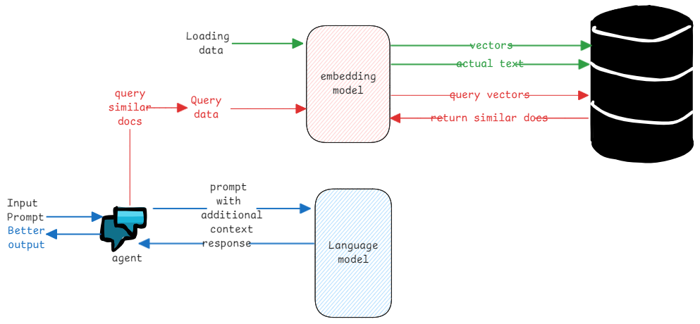

# Embedding models

Embedding is about representing existing text, images or videos as numerical values.

These models helps to convert the text, images and videos into a numerical representation and
store them in vector database.

Later, these numerical representations can be used to find similar text, images or videos.
This is done by comparing the numerical values of the text, images or videos
and finding the closest match. This is called as vector search.

:::info RAG concept
This how RAG concept works where additional contextual data is retrieved from the vector database
and passed to LLM to generate the final output.

Note that the LLM doesn't call the vector database directly.
The agent must call the vector database and retrieve the relevant data
and pass it as context to the LLM.
:::

:::tip why the word embedding
The term "embedding" in AI comes from the idea of embedding something complex into a simpler,
often lower-dimensional space while preserving its essential characteristics and relationships.

This means, placing the text, images and videos inside another representation space.
:::
