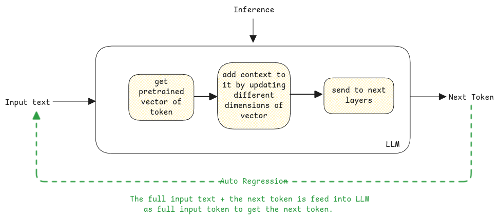

# Output

Output in an LLM is always about predicting the next best token a.k.a the next word.

Example - Which is the capital of France?
The output will be next best word after the full text that is, Which is the capital of France? `{$answer token}`.

Like, this the entire input + generated token (word by word) is passed to LLM to generate the next best word until the full output is generated.

## Probability

The output of the neural network computation will always be another array of floating values for each token in the LLM's vocabulary.

This value is then converted into probabilities.

:::important Temperature and top-p

- **Temperature**: Depending on the this parameter, the LLM decide to chose the token from the list
  generated. The higher the temperature, the more random the output. The lowest temperature (0.0), the
  value with the highest probability is always returned.

- **Top-p**: This is another parameter that decides the number of tokens to be considered for the
  output. Using this value, LLM then only considers the top-p tokens sum of whose probabilities is equal to the top-p value.

- **Top-k**: Just considered the top k tokens with the highest probability for the next token.

:::

