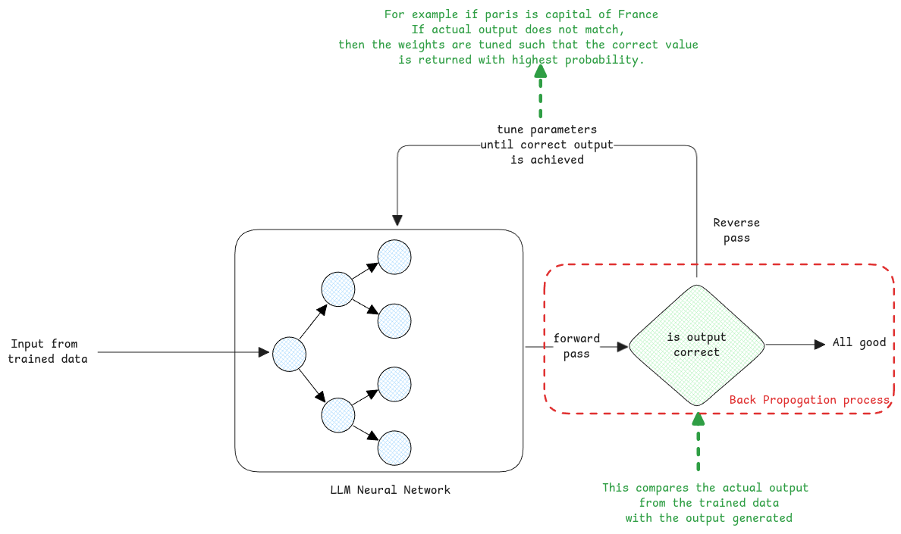

# Training

Training an LLM has two goals.

1. Learns the natural language using the vast amounts of text.
2. Also gathers knowledge.

::: Tip Don't think training to inserting data to database
It's more like learning to speak fluently by reading millions of books, you learn the language itself,
and along the way, you absorb a tremendous amount of information about the world discussed in those books.
:::

## Static Parts

The following numbers are static and are pre-determined before the actual LLM model is trained

1. Number of nodes in the neural network.
2. Number of layers in the neural network.
3. Number of parameters of the model.

## Parameters

Parameters are basically the values that can be tuned during the training.

They're nothing but the knobs in the network that can be tuned with specific values to control the flow.
The parameters are the values then passed along with the vector to

## How Knowledge is stored

It's not like a database which can be queried.
All knowledge is stored as weights and bias in the neural network.

:::danger Not even arithmetic is calculated
LLMs don't compute anything. It's just always **predicting the next word**.

When we ask any arithmetic operation, the LLM from its training knows that if 2 + 3 is 5, then two characters separated by a '+' symbol,
then the most probable next text to this would be a value that's sum of the two input tokens separated by a plus symbol token.

So even in the case of arithmetic operations, the answer isn't a fixed it.
It will always predict a list of various answers with different probabilities.

:::

