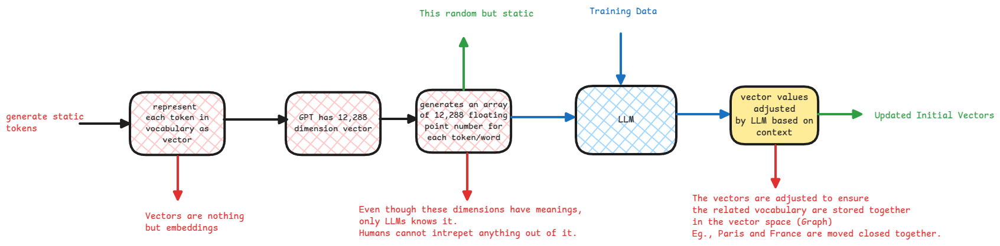

# Vocabulary

## Vectors

Vectors in general means having a multi-dimensional values to represent anything.
This is usually an array of numbers that represents something where each number has a specific meaning.

### Vectors in AI

In AI, vectors are an array of floating point numbers that represents a token. Either by

:::important high dimensional arrays
Think vectors as high dimensional arrays where every dimension has a meaning and only LLM knows the meaning of each dimension.
:::

In case of natural language processing, each word is described using an array of co-ordinates in the word space.
This means, similar words will be close to each other this space.
You can also think of this like location co-ordinates.

:::tip space vs Graph
In case of a graph, the nodes are connected to each other and the relation between the nodes is defined by the edges.

where as in a dimensional space, the relation between the points is defined by the co-ordinates of the points that's the distance between them.
:::

## Vocabulary Size

Even though English vocabulary contains more than 600k words, the tokens recognized during a model training is very less.
It would be somewhere less than 50K. This is because the LLM splits words and takes only unique words as context.

:::warning example of splitting words
If there are words, happiness and unhappiness. In dictionary, this will be two different words.

But the LLM will split it into 'un' and 'happiness' and since it already knows the meaning of un and happiness,
it can easily interpret the meaning of unhappiness without adding it as a separate token.
:::

## Vocabulary Embedding

In an AI model, each word or token is represented as a vector.
This is called vocabulary [embedding](./embedding-models.md).

:::tip n x m matrix
The vocabulary embedding is a matrix of size n x m,
where n is the size of the vocabulary and
m is the number of dimensions in the vector.
:::

## Vocabulary update during training

During the training of an LLM,
the vector for each token is updated based on the context in which it appears.

This is where the tokens related to each other are grouped together in the vector space.

:::danger word vectors are too long
In order to store tons of context for each word, the word vector has around 12K co-ordinates in case of ChatGPT.
:::
