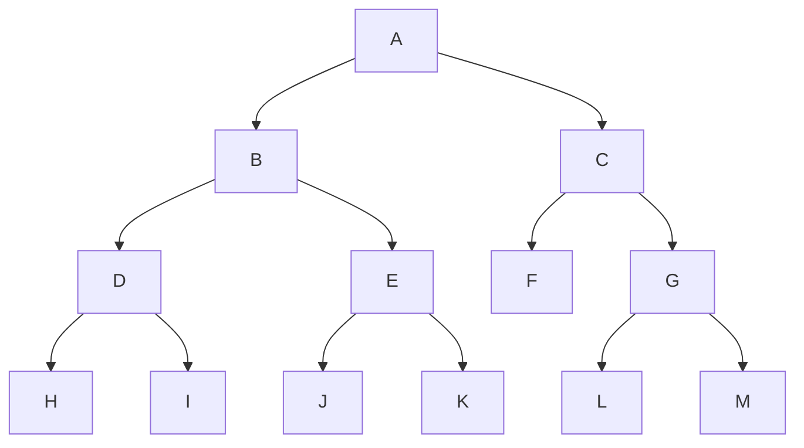

# Graph Search

:::important Search techniques applies to any graphs
The methods discussed in this page applies to any types of graphs.
Meaning, even trees can be traversed using these methods.
:::

There are two ways to mainly do it.

1. **Depth First Search (DFS)** - Go as deep as possible in one branch before backtracking.
2. **Breadth First Search (BFS)** - Explore all nodes at the present depth level
   before moving on to nodes at the next depth level.

:::tip DFS is stack and BFS is queue
This is the main mental model.

- DFS uses stack to traverse a graph.
  Here the stack we use is just the thread stack.
- BFS - uses queue to traverse a graph.
  Here a real queue data structure is being used.
  :::

:::warning processing and visiting a node
When we say processing a node, it means doing some operation on the node like printing its value.

When we say visiting a node, it means just going to that node without doing any operation on it.
:::

## Depth First Search (DFS)

DFS in general means, we transverse until the leaf node and then back track.
While doing it, we can decide the way in which the nodes are processed.

There are three ways to do DFS. These are important for graphs of type binary trees.

1. Pre-order Traversal - Process the root, then the left sub-tree, and finally the right sub-tree.
2. In-order Traversal - Process the left sub-tree, then the root, and finally the right sub-tree.
3. Post-order Traversal - Process the left sub-tree, then the right sub-tree, and finally the root.

:::danger meaning of root
Here when we say root, it means the current node.
Every node is considered as a root of its own sub-tree.
It means, when we reach a node, we start considering that node as root of its own sub-tree.

**Knowing this small nuance then is very important to understand the traversal algorithms.**
:::

:::important meaning of word 'order' in names
Here the 'order' in the names refer to the order in which the **root** of a node is processed.

- **Pre** means, root is processed first.
- **Post** means root is processed last.
- **In** means root is processed in between left and right sub-tree.
  :::

## Example Binary Tree Transversal

- Pre-order Traversal: A, B, D, H, I, E, J, K, C, F, G, L, M
- In-order Traversal: H, D, I, B, J, E, K, A, F, C, L, G, M
- Post-order Traversal: H, I, D, J, K, E, B, F, L, M, G, C, A

## Real life use cases

Just read these use cases to understand where trees are used in real life.
This will also help to understand what these different orders really mean.

### Preorder

- Directory structure listing.
  You visit a directory (root) first → then recursively print its subdirectories/files.
- Data serialization - You write the root node first → then recursively write left and right sub-trees.
  Used in JSON.

### Inorder

- Binary Search Trees (BST) traversal to get sorted order of elements.
  The output is always the sorted order of elements.
  This is by default necessary in case of databases.
- [Expression trees](../data-structures/expression-trees.mdx).
  Ideally this is something that's usable in all 3 types of traversals.

### Postorder

- Deleting a directory tree - Children (files/subfolders) are deleted first → then the folder itself.
- Computing total resource usage / aggregations - You sum child nodes first → then assign parent’s total.

## Breath First Search (BFS)

It has just one way of doing it.
The most important trick is to use queues for adding child nodes that must be processed.

:::important processing technique
We will maintain a queue of nodes to be processed.
All nodes are processed only from that queue.
By queue, we by default ensure FIFO sequence.

As we start traversing the queue, we just add the root node into the queue-
for every node processed, we will read the adjacent nodes of it and then add them to the queue.
:::

:::warning which on to use - DFS or BFS
It depends on the use case and trade-offs.
:::
