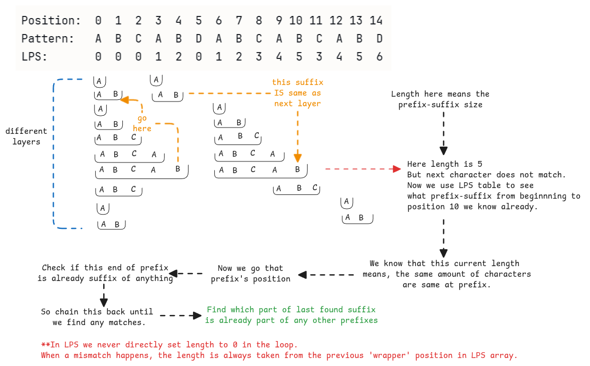

# Knuth-Morris-Pratt Algorithm

This algorithm is one of the many algorithms used for pattern searching.

:::warning Brut force algorithm
Naive pattern matching runs at $$0(M*N)$$.
It's the sliding window method by moving the pattern one bit at a time
on the entire string.

It doesn't understand what the pattern contains.
This is exactly what the KMP algorithm solves.
:::

## LPS - Longest Prefix Suffix

This is the foundation of KMP.
We must build the LPS array of the entire pattern string beforehand to use LPS.

:::important LPS and KMP looks similar
While creating the LPS array of the pattern string,
It looks similar to KMP since even here we don't go through the entire string to find prefixes and suffixes.
:::

:::danger why $$length - 1$$ is mentioned everywhere
**length** variable in all the explanations means the length of the last found longest prefix-suffix.

But length starts it's count from 1 where as the LPS array index from 0.
Hence, when the LPS array is queried, we always do an $$lps[length - 1]$$.
:::

## How KMP uses LPS?

As all pattern matches, we've two pointers.
One for the actual string and the one for the pattern.
We move both whenever there are matches.
But when there is a mismatch, we move only the pointer of the pattern string back.
How much we must move back is what the LPS index provides.

In KMP, whenever a pattern mismatch happens,

- It checks whats the LPS value at index of previous match.
- We move the pointer of the pattern string back to that position.

:::important why does LPS help with KMP pattern search?
The LMP array tells us that the last $$lps[len - 1]$$ characters
you matched are the same as the first $$lps[len - 1]$$ characters.

This base logic is important to be remembered.
:::
