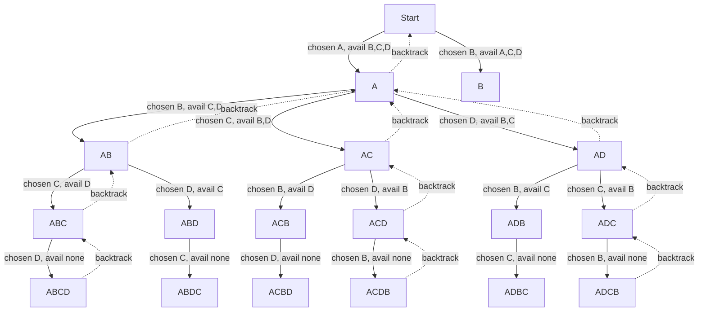

# Recursions

Recursive programming makes a natural way of implementing many use cases.
Since most of the time we use only iterative programming,
it's becomes extremely important in recognizing the solution patterns to decide if recursion fits to a situation.

If we see that the solution can be easily built based on the **base case**,
then recursion can be used for such problems.

:::tip best mental model
Assume you are standing in a long queue and you want to count the queue size.

1. You ask the person ahead of you for his position.
2. He then asks the person ahead of him.
3. This continues until they reach the first person.
   This is the **base case**.
4. Now we know how to count from there.
   Each person adds just a **1** to the previous count to figure out their position.

This is exactly what recursion is.
We've a bigger problem but we can only figure out the solution after reaching the base case
or from the base case.
:::

## Recursions in for loop

A recursion inside a **for loop** is very interesting and
adds more complexity when reading or writing such code.

:::warning Adding different choices
The only thing that a **for loop** additionally adds is **branching**.

It lets the code to choose a branch and then recurse on that branch
and on **return**, choose the next possible branch.
This is exactly what's referred as **Backtracking** or
in other words also called **[DFS](../algorithms/graph-search.md#postorder)**.
:::

### Using DFS in permutation problems

It's important to keep a **standard template** for generating permutations in mind so that
code can be understood for Big O problems and also implemented easily.

:::important Pattern recognition
With recursive programming, it's important that we recognize the pattern.
Once the problem pattern is understood,
it becomes obvious where to use it and how to use it.
:::

| Generic concept      | What it means (abstract)           | Example in permutations       |
| -------------------- | ---------------------------------- | ----------------------------- |
| Current state        | What has been decided so far       | Built prefix                  |
| Remaining decisions  | What choices are still possible    | Remaining characters          |
| State preservation   | Each branch keeps its own state    | Separate prefix per call      |
| Decision exploration | Try one option at a time           | Choose one character          |
| Branch isolation     | One choice doesn’t affect others   | Stack frame per choice        |
| Backtracking         | Undo last decision and try next    | Return to previous prefix     |
| Exploration order    | Order in which states are explored | Depth-first (one full prefix) |

- **Decision Exploration** - Where we decide to explore multiple recursive paths.
  For example, the **for** loop in permutations.
- **Backtracking** - This is the logic where previous decisions are changed and
  alternatives are tried.

In case of a string permutations problem,
the below diagram shows how the recursion based solution generates different combinations.
Here it only shows the first character chosen to be **A**.
The same tree will be duplicated when the execution fully backtracks and then selects **B** for the first position.

:::important Any permutations problem and not just string
This pattern applies to any permutations problem and not just strings.
Consider it for everything.
:::

