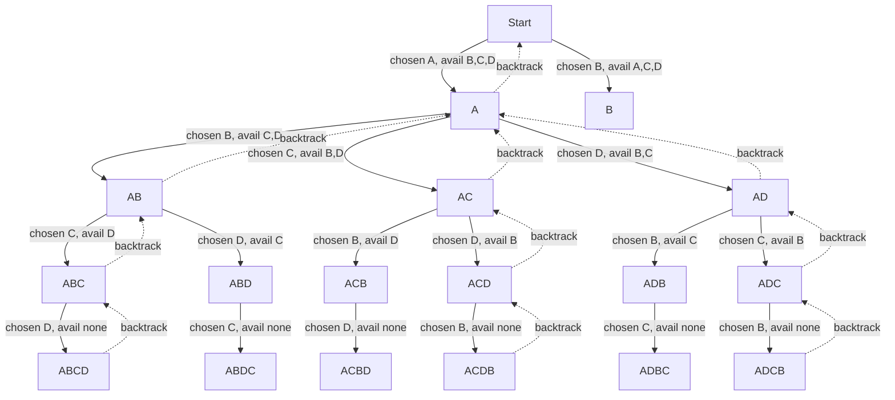

# Recursions

Recursive programming is a natural fit for many use cases.
We mostly use iterative programming.
It's key to spot the patterns where recursion fits.

If you can build the solution from the **base case**, recursion fits the problem.

:::tip best mental model
Assume you are standing in a long queue and you want to count the queue size.

1. You ask the person ahead of you for his position.
2. He then asks the person ahead of him.
3. This continues until they reach the first person.
   This is the **base case**.
4. Now we know how to count from there.
   Each person adds just a **1** to the previous count to figure out their position.

This is exactly what recursion is.
We've a bigger problem. But we can only solve it once we reach the base case,
or from the base case.
:::

## Recursions in for loop

A recursion inside a **for loop** is interesting.
It makes the code harder to read and write.

:::warning Adding different choices
The **for loop** just adds **branching**.

The code picks a branch and recurses on it.
On **return**, it picks the next branch.
This is exactly what we call **Backtracking**,
also known as **[DFS](../algorithms/graph-search.mdx#postorder)**.
:::

### Using DFS in permutation problems

Keep a **standard template** for permutations in mind.
Then the code is easy to read for Big O problems and easy to write.

:::important Pattern recognition
With recursion, you must spot the pattern.
Once you see the problem pattern,
where and how to use it becomes clear.
:::

| Generic concept      | What it means (abstract)           | Example in permutations       |
| -------------------- | ---------------------------------- | ----------------------------- |
| Current state        | What has been decided so far       | Built prefix                  |
| Remaining decisions  | What choices are still possible    | Remaining characters          |
| State preservation   | Each branch keeps its own state    | Separate prefix per call      |
| Decision exploration | Try one option at a time           | Choose one character          |
| Branch isolation     | One choice doesn’t affect others   | Stack frame per choice        |
| Backtracking         | Undo last decision and try next    | Return to previous prefix     |
| Exploration order    | Order in which states are explored | Depth-first (one full prefix) |

- **Decision Exploration** - Where we decide to explore multiple recursive paths.
  For example, the **for** loop in permutations.
- **Backtracking** - This is the logic where previous decisions are changed and
  alternatives are tried.

For a string permutations problem,
the diagram below shows how recursion builds the combinations.
It shows only the first character chosen as **A**.
The same tree repeats when the run fully backtracks and picks **B** for the first spot.

:::important Any permutations problem and not just string
This pattern applies to any permutations problem and not just strings.
Consider it for everything.
:::

