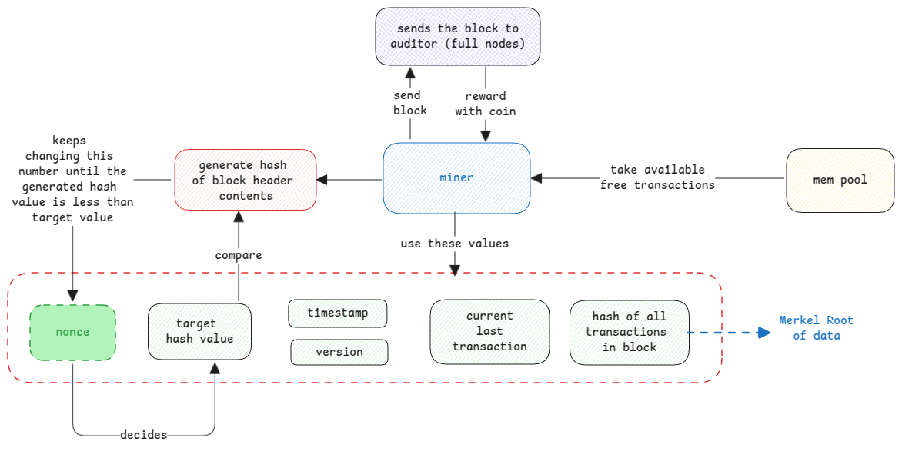

# Bitcoin

Always compare it to gold and not to regular cash.
Similar to gold, the bitcoins not unlimited and also must be mined.

## How bitcoin mining works

Miners are special nodes because these are the ones with high computational needs.
They're in the network and get the list of transactions that are yet to be added to the block chain.

They run compute intensive hashing task to generate an hash of the block header.
It's important that the variable is the **nonce** value which is constantly changed until the hash value
is less than the target hash value.

:::tip meaning of nonce
**nonce** means number used once.
:::

:::danger only limited blocks generated
The protocol is built in a way to ensure the mining of a block takes 10 minutes always.
This basically means, the target hash value is adjusted such that the mining takes always the same
amount of time.
:::

## Bitcoin Rewards

The bitcoin is rewarded to miners for the work they do to generate blocks.
It's then up to the miners to transfer or sell it to anybody else.
This is how bitcoins are generated in the network.

**coinbase** is the term given to the reward transaction done.
This is added as a transaction in the generated block to claim the reward.

:::important Analogy with Gold
Comparing cryptocurrency with normal currency isn't the right one.
It's better to compare it with gold.
Both gold and cryptocurrency are mined (only when miners generate a block, new bitcoins are released)
and both are limited in availability.
:::

## Transaction Fees

In addition to the mining reward, the miner also gets transaction fees.
This fees depends on the transactions that are part of the block.
When a transaction is initiated by the user, the wallet software automatically sets this value.

## Miners pick transactions

Its left to the miners to pick transactions in the block based on the transaction fees **offered** by the user.
So this mean, each block can be mining any transaction that it can pick from the mempool

:::tip handling duplicates
If two miners have generated a block at same time and in case both have any transaction common,

1. Some of the peer nodes will receive first generated block and it will accept it and to block chain.
2. Some of the peer nodes will receive second generated block and it will accept it and to block chain.
3. Now a **temporary fork** occurs. This means, two versions of the block chain exists in the network.
4. Now the miner which builds the third block will add to whatever block chain it receives from it's full node.
5. So this block chain now becomes the longest one becomes the active one and other block chain is discarded.
   :::

## Gossip Protocol

The peer-to-peer communication between the block chain nodes is done using **gossip** protocol.
In this protocol, the peer broadcasts the information to all connected nodes
and the connected nodes forward to the next connected nodes.

:::danger not all peers are connected
Here not all nodes are connect to all other nodes in the network.
There is a limit on number of nodes a node in the network connects to.
:::

## Software in nodes and miners

Nodes and miner servers are hosting application in any programming language and
communicate with other nodes using TCP.

## Network Setup

## How errors are handled

Assume a block was validated and accepted by one full node and forwarded it to its peers.
Now if a peer rejects it, then there is a **temporary fork** in the network.

Now the miners connected to this node which accepted the block will continue to build on this block.
The miners which are working connected to other nodes which start building on the correct last updated block.

Eventually, the block chain with more blocks will be accepted by the network and the other block chain will be discarded.
