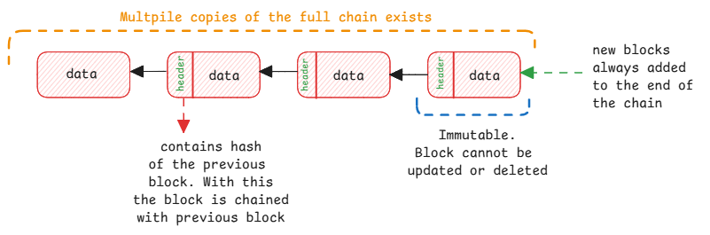

# Block Chain

Block chain has the following main characteristics:

1. Data is grouped into blocks.
2. Each block is immutable.
3. Blocks are linked together in a chain.
4. Each block is cryptographically connected to previous block.
5. Entire chain is managed by parties who don't trust each other and
   also don't trust a central authority.

:::danger Trust model and not privacy
Blockchain isn't a data security technology.
It's not for storing encrypted data or protecting data from unauthorized access.
It's a technology for storing plain data in a way that it can't be changed or tampered,
by any party.

**NOTE**: If at all the block chain transaction history must store any sensitive data,
we can even encrypt and store it and only the trusted consumers of the blockchain can then decrypt it.
:::

## Why is it secure?

**Tamper-proof** - Changing data in a past block would change its hash, which would break the chain.

**Consensus-based** - Changes must be agreed upon by many nodes in the network.
This includes also deciding the complexity of proof of work, validation rules and many more.
Here the consensus is reached not through vote but through verifiable proof of work.

**No central authority** - The system relies on rules and cryptography, not trust in a single party.

## Proof of Work

This is a concept of blockchain where the it's not easy to allow anybody to add a block to the chain.

1. Either you simply trust people and systems who adds blocks to the chain.
2. Or you make it difficult to add a block to the chain by making it computationally expensive.

The second option is called **proof of work**.
In this, the miner must solve a complex computation problem that needs a lot of computing power.
This proves that the system trying to add the block has put efforts into it.
