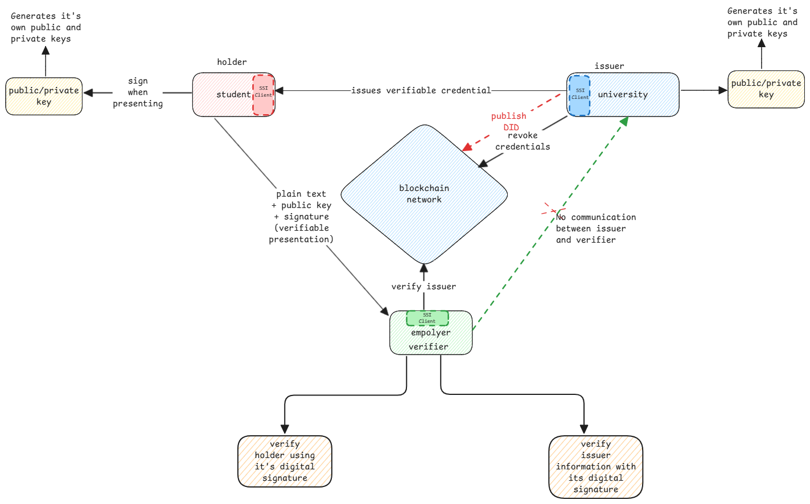

# Self Sovereign Credentials

## Verifiable Credential

A verifiable credential is nothing but a credential that can be verified by a third party without asking the issuer.

:::important similar to PKI infrastructure
In case of SSL, the certificates issued by a CA is blindly trusted.

But in SSI, the certificate can be verified against a public, distributed record,
without asking the issuer again.
:::

:::tip Credentials are sent in plain text
When credentials such as a degree certificate or drivers license is sent to a verifier,
it's sent as plain text. The data itself isn't encrypted.

This is why [digital signatures](../security/digital-signatures) are used for this purpose.
:::

## DID

DID stands for Decentralized Identity.
Normally identities are centralized which means the credentials are stored on a central server.

1. DID can already contain a key which already has its public key information.
2. Or the Information can be stored in a block chain and can be fetched using the ID.
3. Or the information can be stored in a central registry.

## Verifiable Presentation

It's the verifiable credential that's presented by the **holder** to the **verifier**.

1. It can contain the full credential received from issuer or partial.
2. The credential contains also the signature from the issuer.
3. Signed by the holder to prove his identity.

:::warning Mutiple proofs
The verifiable presentation has an parent proof for the entire DID document, 
and the DID document internally contains the proof details of the issuer.
:::