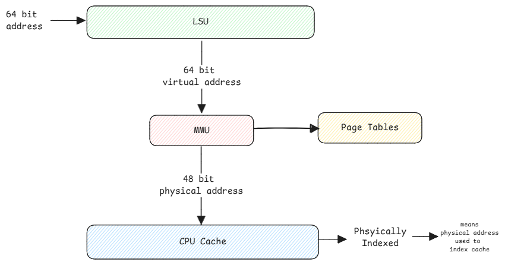

# CPU Caching

CPU has multiple levels of cache (L1, L2, L3) to speed up data access.
Each cache level is larger and slower than the previous one, with L1 being the smallest and fastest,
and L3 being the largest and slowest.

1. Large - More data can be stored.
2. Slow - The cache key has to be searched from the largest data set and
   also the cache must move from different levels to L1 and then finally to the register.

## Cache Lines

Cache line is nothing but the each cache entry size.
This is a fixed value across all cache levels. Typically, a cache line is 64 bytes.
This value is something fixed by the CPU manufacturer and can't be changed or configured by the user.

:::tip Line doesn't mean anything physical here
The line here is actually a specific block of memory in the cache.
Entire cache area is split into fixed size blocks called cache lines.
:::

## Cache Addressing

The CPU asks for a value at a specific address.
To get the data from that specific address,
the CPU cache has a logic to use that address itself as cache key to search in the cache.

Also, to note that the entire caching happens using the physical address and not the virtual address.

:::important Index Key Calculate
a. Divide the entire cache size by the cache line size to get the number of cache lines.
b. Then divide the number of cache lines possible by number of 'associativity' to get the number of sets.
c. Then use the index bits to calculate the index key.

In case of L1 Cache of 32 KB with 64 B cache line size and 4-way associativity:

- Number of cache lines = 32 KB / 64 B = 512 lines.
- Number of sets = 512 lines / 4-way associativity = 128 sets.
- Index key = 7 bits to get address 128 sets.

**This same logic is used to split all 3 levels of cache.
Just different 'N-way' associativity is used to split the cache lines into sets.**
:::

## Zeroing-Out Bits

When the LSU component of CPU asks for data at a specific address,
the cache controller always sets the last 'N' bits depending on the cache line size to zero.

If the cache line is 64 bytes, then the last 6 bits are set to zero.
This is necessary to fetch the data before and after the requested address to provide **spatial locality**

The LSU then uses the multiplexer to extract the relevant data from the cache line.
It means, LSU knows the exact byte it needs to extract from the cache line data it received from the cache controller.

## Writing Data To Memory

Most common way is to use 'Write-Back' policy.

1. LSU issues STORE instruction to write data to cache.
2. Cache controller checks if the cache line is already present in the cache.
3. If present, it updates the cache line and marks it as dirty.
4. When cache is evicted, then the updated cache line is written back to the next level.
   Eventually when it's evicted from L3, it's written back to the main memory.

:::warning Write during cache miss
When a write happens during a cache miss,
then the data is loaded all the way from the main memory to the cache
and then written back to the cache and the **dirty** flag is set.
