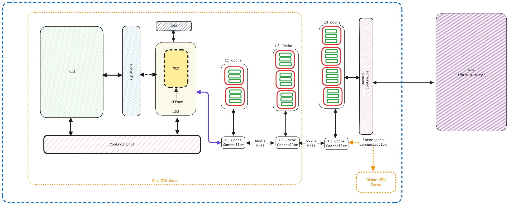

# CPU Components

1. **ALU** - Responsible only for integer operations.
2. **FPU** - Responsible only for floating point operations.
3. **SIMD** - Single Input Multiple Dimensions.
4. **Registers** - Holding data.
5. **LSU** - Load and store unit responsible for handling memory operations.
6. **CU** - Control unit responsible for the execution.
7. **Cache** - Multiple cache layers.
8. **MMU** - Memory management unit responsible for mapping virtual memory addresses to physical ones.

## SIMD

SIMD is also called as **Vector Unit**.
It's for high speed processing for arrays where entire array operations are just done in one go
instead of using FOR loops.

:::important SIMD availability
SIMD is available in most modern day CPU architectures
but its more powerful and heavily used in GPU hardware.
:::
