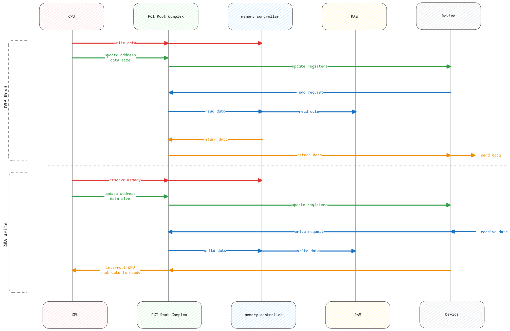

# Direct Memory Access (DMA)

This is a method where the devices can directly transfer data to and from main memory without CPU moving each byte.

:::danger Programmed IO (PIO)
This is the regular way of copying data from memory to device.
Where every byte goes via CPU.
:::

## How it works

1. CPU tells the device about the memory address and length.
2. Device’s DMA controller moves the data on the system bus directly to/from RAM.
3. CPU is free to do other work during transfer.

