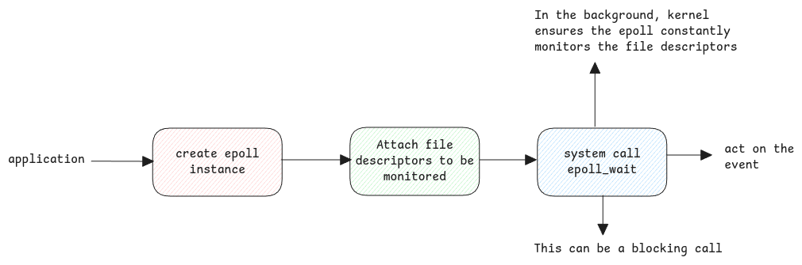

# epoll

epoll means edge polling. It means when edge states are changed, the relevant events are triggered.

## Legacy Polling Mechanism

For all IO tasks, the kernel updates the file descriptor flags to signal if there is data ready to be acted upon.

This would mean, the user space applications must pass all the file descriptors that they need to check and
kernel will have to update back if any flag has changed.
This polling has complexity of 0(n) and the polling also involves system call which needs data to be copied between userspace and kernel space.

## epoll

epoll avoids userspace from polling the file descriptors.
Instead we ask kernel to create an epoll instance and ask it to monitor which ever file descriptors we're interested in.

After this epoll monitors the file descriptors independently.
The application will have to only monitor the epoll instance which will be updated as soon as there is any state change.

