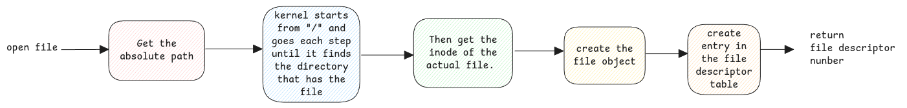

# File Descriptor

Each process has a file descriptor table.

Every thread has **task_struct**.
This structure has a pointer to **files_struct** and
this is nothing but the file descriptor table.

This file descriptor table is just a map of file descriptor ID and
the pointer to corresponding **file** structure.

:::tip file structure
The **file** structure represents an open file.
It has pointers to the corresponding **inode** structure and
also pointers to different operations that can be executed on it.
:::

This file structure then contains all necessary information such as the device's major number, minor number,
file location, file operations, permissions and also the pointer to inode structure of the this file.

:::info File descriptors are C objects
File descriptor are C objects created by kernel and remain in it's memory.
Only for uniformity sake, these values are also written to the file system under **/proc**.
:::

:::danger closing files
This why closing a file is important from userspace applications.
Otherwise the file descriptors remain open and will consume memory.
:::

## Sockets

File descriptors aren't just for actual files. It's also used for sockets.
Similar to how we use **open** method to get the file descriptor of a file,
we use **socket()** method to get the file descriptor of a socket.

:::danger File descriptor is just in kernel memory
Similar to all other kernel objects, file descriptor table also exists in memory and
it's just for reference also created on filesystem.
:::

## Device Files

These are files in /dev directory. They don't contain any data.
It only contains the major and minor number in its meta data which defines the device driver that handles the underlying device.

## Device Drivers

Any device driver must implement certain API methods defined by the kernel.
For communication across devices, the same API methods are called by userspace/kernel applications.

:::info Useful links

-   https://biriukov.dev/docs/fd-pipe-session-terminal/1-file-descriptor-and-open-file-description/
-   https://bottomupcs.com/ch01s03.html

:::
