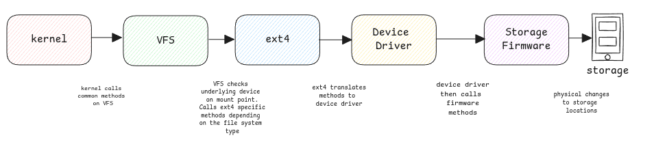

# File System

File systems means how the storage is used organized and used by the operating system.

The storage systems refer to hardware which has physical space and
firmware on top of it which physically reads and writes to specific addresses.

While file systems refer to the software which then utilizes the storage system
to have an hierarchical directory structure on top of a plain disk,
control its permissions, etc.
The file system software then decides how it would like to use this plain storage.

## Formatting a disk

When we format a disk,
it basically means the storage is prepared to be used by a specific software such as ext4, NTFS, FAT, etc.

:::tip format to ext4
It means the clearing the existing data and
creating super block of that storage, root inode information, etc.

For the underlying storage, super block and other information are just stored in a regular place.
It has no special meaning for the storage hardware itself.
:::

## Map file systems to mount points

**fstab** file has the mapping of all file systems to different directory
in the full file structure hierarchy.

This file shows which storage system is mounted at which directory.

:::tip file system information at boot
When system boots, all hardware is detected and using the data at **/etc/fstab**
they're mounted (linked) to different directories and
depending on the file system type in this file, the VFS then speaks to the underlying
storage system to get files and directories information.
:::

## Device Drivers

These are the common methods called by the **ext4** methods irrespective of the underlying
storage manufacturer.

## Storage Firmware

These are the storage manufacturer methods invoked by device drivers.

## File system block size

It's the minium size used by the file system to manage files.
This means, if the block size is 4KB, even a file with just one letter with block 4KB space on storage.
Mostly the size of the block is kept same as the physical sector size for better performance.

:::danger sector sizes vs file system block sizes
sectors sizes are something managed by the firmware.
:::

## Partition

A physical disk can be logically split into multiple logical disks and
each logical disk can be formatted into a completely different file system.

:::tip transparent to hardware
This partitioning of the physical storage is completely transparent to the
storage and it's firmware.
:::
