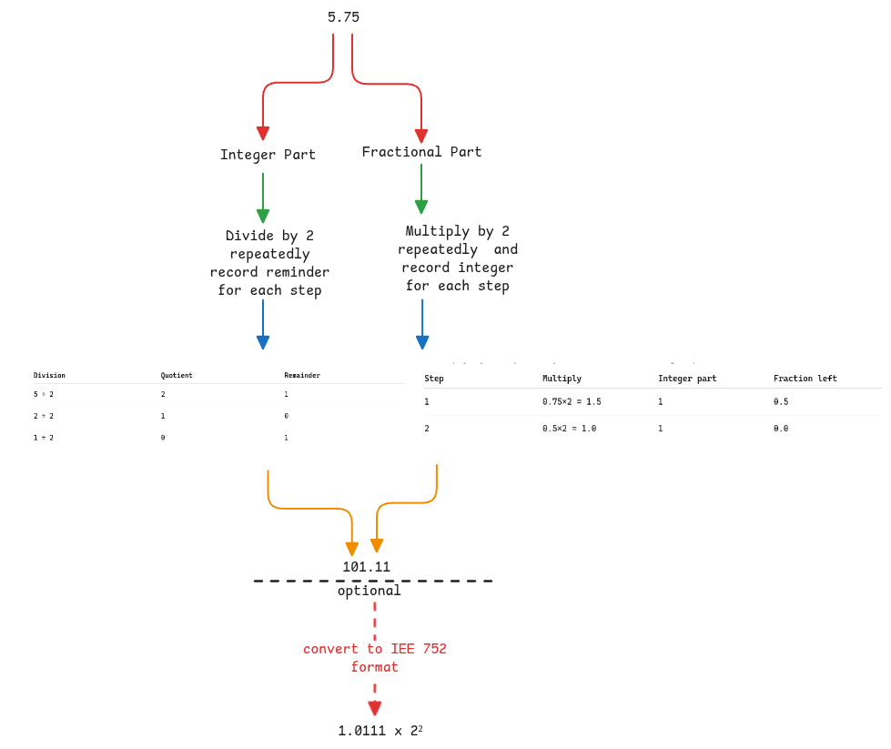

# Floating Point Numbers

I always assumed that the floating point numbers are simply handled as two different integers with dot separated.
But this is completely wrong.
Floating point values are just stored as one single value in floating point specific registers
but with very different binary manipulation and standards.

## Converting floating numbers to binary

Integer and fractional parts are handled differently.
They're not treated as just two integers separated by decimal point.

## Standards for binary representation of floating numbers

All CPU architectures follow one single standard called the IEE 754 to represent the floating numbers.
It uses the [scientific notation](../mathematics/scientific-notation.md) and
normalization to ensure the integer part of the binary is always just **1**.
This is the exponent of base 2 since the value is binary.

:::important Ensuring **1** in integer part.
When we convert a decimal to binary, there will be **1** at some location for sure.
The normalization will keep moving the decimal point to **left** until it reaches the first **1**.
:::

Finally what's stored is - sign bit + exponent + mantissa (fractional part) only.
Here the main assumptions are -

- The integer part is understood that it's always 1.
- The size of sign, exponent and mantissa bits are fixed.
- The bias added to the exponent is known based on the register size.
- Exponent is for base 2 since it's binary.

:::danger exponent can be positive or negative
The exponent itself can be positive or negative
depending on how decimal is moved to get just **1** before the decimal point.
:::

### Adding Bias to Exponent

In this floating point representation standard,
the exponents has to be just positive to make the comparison easier.
Meaning, the size of the exponent can be directly used to determine if a number is greater or smaller.

:::tip Meaning of bias in this context
Bias in english means, having an opinion different to truth.
That's exactly what's done in IEE755.
The actual value of exponent is biased with a fixed value.
:::

For example, in case of 32 bit float, the bias value is 127.
This is because 32 bit float register has 8 bit reserved to represent exponent.
This means, the exponent can be 2⁻¹²⁷ to 2¹²⁸ and the bits will hold (—127) to 128.
But we will add 127 to each of them to ensure only positive numbers are stored.

## Floating point in programming languages

When we instantiate floating point numbers in Java,
it already converts it to IEE 758 format before storing it into memory.
It's an hardware requirement that's directly fulfilled by all programming languages.

## FPU in CPU

FPU is a component in CPU that implements and handles IEE 754 standards.
ALU is used only for integers and FPU is used for all floating point calculations.
