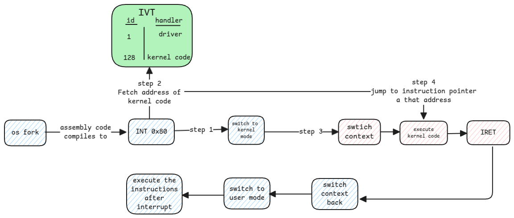

# Interrupt Handlers

## Interrupt Vector Table

This is a table that maps id of the interrupt to the **address** of the handler which must handle the interrupt.

:::tip why is it called vector
It's called a vector table because this table shows the direction where to go.
:::

## Hardware Interrupts

In case of hardware interrupts, the table contains the list of device drivers.

1. During boot, the BIOS reads the configuration requirements of each device and
   assigns IRQ ID for each device and stores in its configuration space.
2. During the kernel initialization, the driver of each device then reads the IRQ ID
   from it's own device's configuration space and updates the IVT table with its handler address
   for that specific IRQ ID.

:::important Polling Interrupts
In case of hardware interrupts, the CPU polls the interrupt flag at specific intervals.
:::

## Software Interrupts

This interrupt comes only from userspace applications to the kernel for any service that it needs from the operating system.

During boot, the kernel registers itself as one of the handlers in the IVT table.

These software interrupts are called as **system calls**.

:::info ID of the software interrupt handler
In case of Linux, the ID of the software interrupt handler in the IVT is always 128 (0x80)
:::

