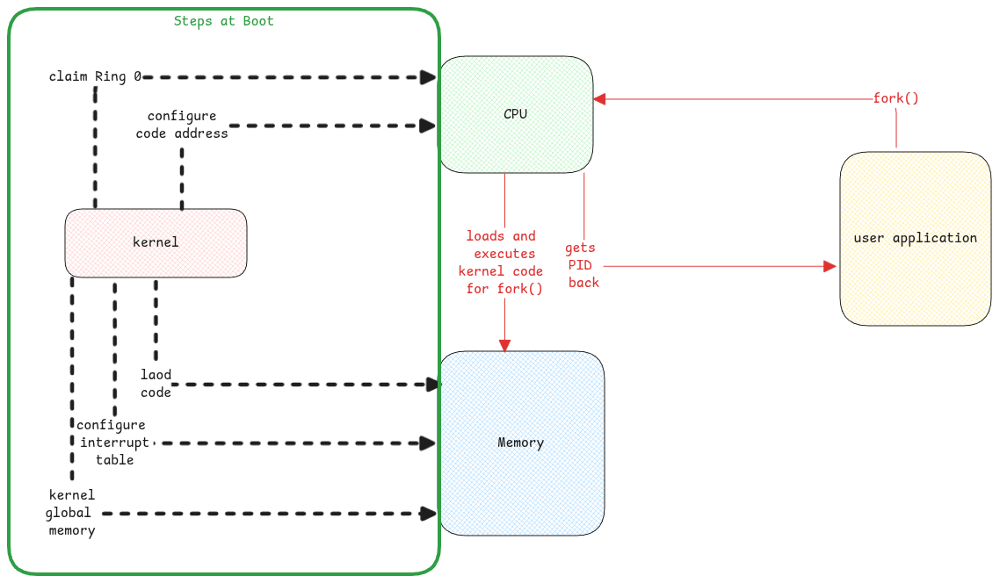
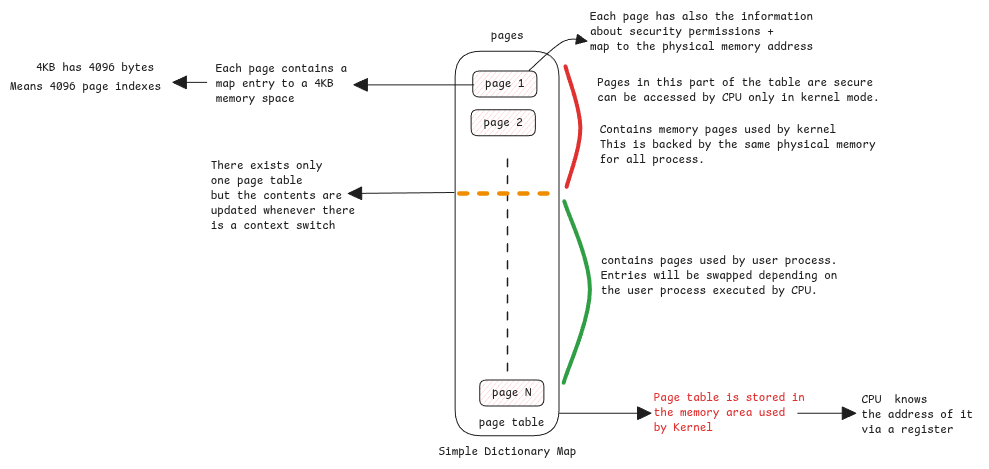

# Kernel at Boot

This page only tries to document learnings that are common to every kernel,
implementation that it must be followed by every kernel as mandated by CPU architectures.

:::warning kernel isn't a process
Kernel isn't an ever running process.
Consider it as a startup script that runs at boot and
exits after starting the [init process](../linux/initrd.md).
:::

## Kernel as library

Kernel just acts as a library where it just loads all its system call code and drivers into memory.
It updates certain specific CPU registers which mentions the memory address of its system call code and
also code to be invoked when there is an IO interrupt.

After that, it's only userspace process that use these kernel methods directly within it's thread via system calls or
it's the IO interrupts generated by hardware which is then forwarded to specific interrupt handlers.

:::important kernel memory space
Every process that's created from userspace gets it's memory page table.
A part of table has a mapping to the global shared kernel space.

It looks as if it's process specific but it's shared and only kernel will access it whenever there is a system call.
All objects created by kernel code is in this memory area.
:::

:::tip Example of Kernel Memory Security

When an userspace process wants to create a file,
the system call instruction of the CPU then switches the context.
Since it already knows the address of the kernel code, it will execute it.

Kernel will then create the necessary File objects and
return only the ID to the userspace.
It doesn't receive any pointer to kernel objects.
Userspace applications will have to use this ID further system calls.
:::
