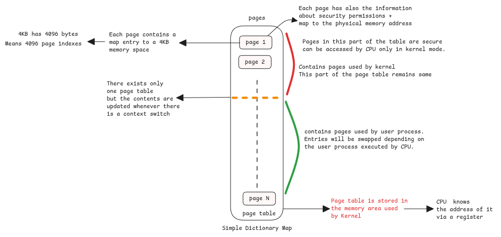

# Memory Paging

Whenever CPU reads or writes to a memory address,
it's not referring to the actual address in the physical memory (RAM).

Instead it's referring to the virtual address pointer and
then uses MMU (Memory Management Unit) to translate it to the actual physical address pointer.

:::info what's 64 in x86-64 systems
64 here defines the number of bits used to access the memory address.
With 64 bits, 16Exabits of memory can be accessed. No computer today has a RAM of this size.
:::

## Terminologies

**Page Table** - It's a dictionary stored within the kernel process space in RAM.
Address of this table is made available to the CPU via a register at boot time.

**Page** - Every entry in the page table is called a page.
It contains the physical address behind every virtual address plus
the security details such as readable/writable, allowed for user or kernel,
present flag, etc.

**Page size** - This defines the amount of memory that can be addressed by each page.
In Linux the default is 4KiB

**Page index** - The address of each byte inside the memory block addressed by a page.

:::important Page size matters
4KiB is 4096 Bytes.
We need 12 bits to access each of this 4096 bytes.
This means, the address returned by the MMU is just 64—12=52 bits + 12 zeros which
is the starting address of the memory block.

Bigger the page size means, more bits are needed to index the page.
:::

## Paging

Paging is an operating system concept where the data from memory is written to disk when it runs
out of memory.

:::tip Present flag
whenever a chunk of memory is paged to disk,
then the page table entry for those memory block will be have **present** flag as false.
:::

### Paging Fault

Paging fault is a type of exception trapped by CPU when MMU sees that the address requested for
isn't present in RAM (present flag is 0) and lets kernel handle it.

Kernel loads the paged memory back to memory and asks CPU to retry the user process.

## Segmentation Fault

This is returned by the operating system when an invalid access to a memory location occurs.

For example, accessing a kernel page from a userspace process.

:::note Null Pointer Exception
This is similar to Java's null pointer exception.
Java provides higher level abstraction and checks and then throws Null Pointer Exception.
:::

## Swapping

Swapping is similar to paging but in case of swapping the entire process memory is moved to disk
whereas in case of paging, only specific pages from multiple processes are moved to disk.

:::danger not to be confused with page cache
Page cache is a completely different topic.
It's about caching disk data into memory to avoid frequent disk IO.

This is also called System \*_System Buffer_
:::

## Data between user and kernel memory space

Due to security reasons, the user space can't access data from kernel space and vice versa.
The data must be copied.

The data between these two memory areas are always copied to the other area by the kernel.
