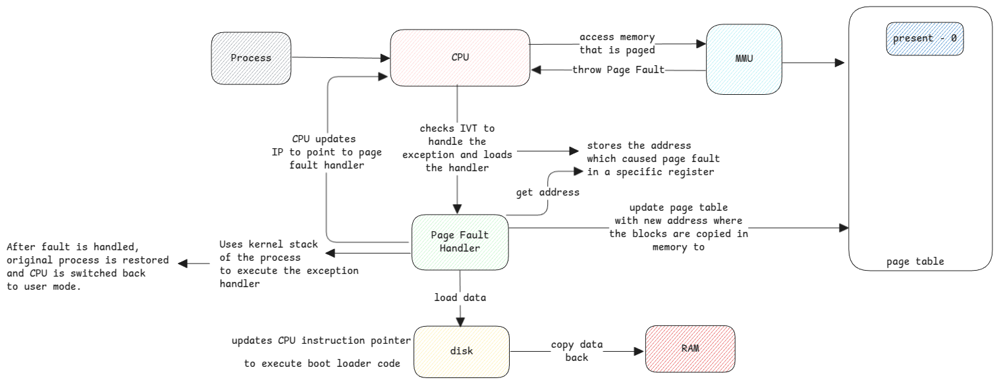

# Memory Paging

Paging is a concept that works with the co-ordination between
hardware and software components.

**CPU and MMU** - Defines which registers to enable virtual addressing, storing page table address,
and how page faults are thrown.

**Operating System** - Implements updating the necessary registers, handle page faults thrown from MMU.

## Page Table Structure

CPU architecture defines the bit structure which defines which bit represents what.
Last part of the entire bit array then has the actual physical address.
This can be either the physical address in memory, or swap address when it's swapped.

This bit structure is updated by MMU and also by CPU based on the scenario.

:::important physical address
This is just the address of the first byte in the 4KB memory page.
:::

Whenever CPU reads or writes to a memory address,
it's not referring to the actual address in the physical memory (RAM).

Instead it's referring to the virtual address pointer and
then uses MMU (Memory Management Unit) to translate it to the actual physical address pointer.

## Page Fault Types

1. File backed page - where only the required parts of the file are loaded already in RAM.
   Remaining needs to be loaded.
   This is lazy loading. Means, the data is first loaded from disk when it's needed for the first time.
2. Anonymous Page - Needed only for storing application data such as objects in memory.

:::info File backed pages
This type of pages is used for loading the application itself in the memory
and also when the application wants to load any file from disk into memory.

A good example will loading java binary itself
and then how java loads the jar file.
:::

## Block and Page Size

Normally, the size of the page in the memory is kept same as the block size of the disk.
This will help to have just one to one mapping between memory pages and disk blocks
and reduces the overhead of multiple IO.

It's important to understand that

- **page size** which is the smallest fragmentation of memory.
- **block size** is the smallest fragmentation of storage.

:::danger Memory mapped files
This is only for memory mapped files.
For anonymous access, this isn't relevant.
But the memory is still organized into pages.
:::

## Terminologies

**Page Table** - It's a dictionary stored within the kernel process space in RAM.
Address of this table is made available to the CPU via a register at boot time.

**Page** - Every entry in the page table is called a page.
It contains the physical address behind every virtual address plus
the security details such as readable/writable, allowed for user or kernel,
present flag, etc.

**Page size** - This defines the amount of memory that can be addressed by each page.
In Linux the default is 4KiB

**Page index** - The address of each byte inside the memory block addressed by a page.

:::important Page size matters
4KiB is 4096 Bytes.
We need 12 bits to access each of this 4096 bytes.
This means, the address returned by the MMU is just 64—12=52 bits + 12 zeros which
is the starting address of the memory block.

Bigger the page size means, more bits are needed to index the page.
:::

### Handling Page Fault

Paging fault is a type of exception trapped by CPU when MMU sees that the address requested for
isn't present in RAM (present flag is 0) and lets kernel handle it.

Kernel loads the paged memory back to memory and asks CPU to retry the user process.

## Segmentation Fault

This is returned by the operating system when an invalid access to a memory location occurs.

For example, accessing a kernel page from a userspace process.

:::note Null Pointer Exception
This is similar to Java's null pointer exception.
Java provides higher level abstraction and checks and then throws Null Pointer Exception.
:::

## Swapping

Swapping is related to paging but in case of swapping the entire process memory is moved to disk
whereas in case of paging, only specific pages from multiple processes are moved to disk.

:::important paging and swapping
Paging is about loading only what's necessary or when it's first requested.
Swapping is moving data out of RAM to allow space for other processes.
:::

:::danger not to be confused with page cache
Page cache is a completely different topic.
It's about caching disk data into memory to avoid frequent disk IO.

This is also called _System Buffer._
:::

## Data between user and kernel memory space

Due to security reasons, the user space can't access data from kernel space and vice versa.
The data must be copied.

The data between these two memory areas are always copied to the other area by the kernel.

## Addressing using Offset

Applications know only their virtual address space allocated to it.
Offset is all about how the applications can access different locations in it's memory space.

1. In case of array, we only know the location of first index. Offset is used to go to other indexes.
2. JMP instructions take the offset address from the current location to get the instruction code.
3. Even in case of classes, the properties of the classes are accessed using same offset concept.
