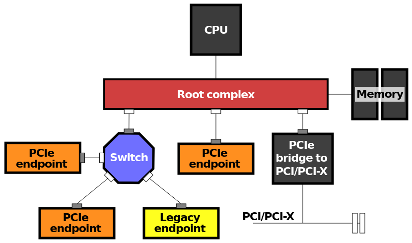

import { ThemeImage } from '@site/src/components/ThemeImage';

# Peripheral Connect Interconnect (PCI)

It's a specification that defines

1. electrical signals are transferred on the data bus - voltage levels, signal timing and physical layout of connectors.
2. Data transfer between CPU and devices - How data is packaged, addressed and transmitted (requests, acknowledgement transactions).

:::important PCI is becoming the default
In modern systems, all devices are connected to the CPU using PCI.
Even if the devices don't support it, the conversion is handled by the respective controllers.
:::

## Analogy with database

This is very similarly to how database standards are implemented.

Initiate transaction -> setup connection -> send data -> commit transaction.

:::warning its not a chip
PCI isn't a physical chip.
It has only specifications and the motherboard and devices must implement it.
:::

## Address Allocation

Physical address allocation happens at boot when all devices are enumerated
and added to the root complex.

<ThemeImage src='/img/device-address-mapping.excalidraw.png' alt='address-mapping' />

## Root Complex

All PCI devices are linked to the CPU as a tree.
When there are multiple roots, they're just added as child trees to the root trees.
It's interesting to note that even RAM is part of the same root.

The root complex knows which physical address is part of which branch in the tree.
The requests from CPU are routed to that specific branch.
When the address falls in the RAM address range, it will be forwarded to the memory controller.
But if it's for PCIe device's BAR range, then the root complex formats the request into a PCI packet.

:::important addressing packets to devices
When the packet is sent through a branch,
all PCI devices on the branch gets the packet.
But only the device for which the packet is intended to will accept the request.
This is exactly why each device configures it's BAR with this allocated physical address at boot.
:::

:::note image source
The picture above is taken from [Wikipedia](https://en.wikipedia.org/wiki/PCI_Express).
:::

:::warning PCI devices via chipset
For PCI devices connected via the chipset,
the chipset only validates and forwards the request to the root complex of CPU.
:::
