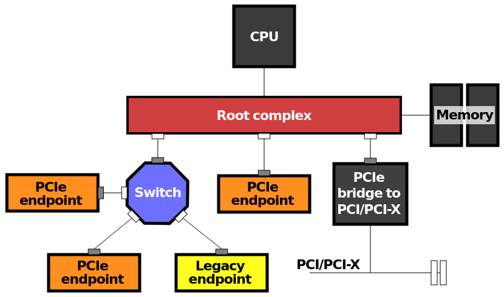

import { ThemeImage } from '@site/src/components/ThemeImage';

# Peripheral Connect Interconnect (PCI)

It's a specification that defines

1. electrical signals are transferred on the data bus - voltage levels, signal timing and physical layout of connectors.
2. Data transfer between CPU and devices - How data is packaged, addressed and transmitted (requests, acknowledgement transactions).

:::important PCI is becoming the default
In modern systems, all devices connect to the CPU using PCI.
If a device doesn't support it, the controllers handle the conversion.
:::

## Analogy with database

This is much like how database standards work.

Initiate transaction -> setup connection -> send data -> commit transaction.

:::warning its not a chip
PCI isn't a physical chip.
It's only a specification. The motherboard and devices must implement it.
:::

## Address Allocation

Physical addresses are allocated at boot. This is when all devices are enumerated
and added to the root complex.

<ThemeImage src='/img/device-address-mapping.excalidraw.png' alt='address-mapping' />

## Root Complex

All PCI devices link to the CPU as a tree.
With many roots, they're added as child trees to the root trees.
Even RAM is part of the same root.

The root complex knows which address belongs to which branch.
It routes the CPU requests to that branch.
If the address is in the RAM range, it goes to the memory controller.
If it's in a PCIe device's BAR range, the root complex turns the request into a PCI packet.

:::important addressing packets to devices
When the packet goes through a branch,
all PCI devices on it get the packet.
Still, only the target device accepts the request.
This is why each device sets its BAR with this address at boot.
:::

:::note image source
The picture above is taken from [Wikipedia](https://en.wikipedia.org/wiki/PCI_Express).
:::

:::warning PCI devices via chipset
For PCI devices behind the chipset,
the chipset just checks and forwards the request to the CPU's root complex.
:::
