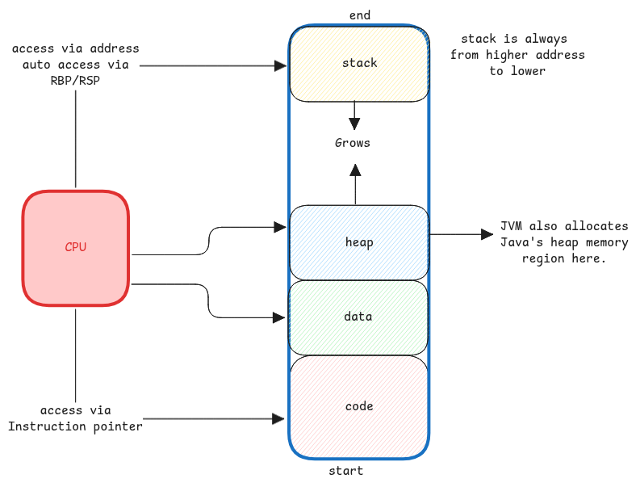

# Process Memory

When a program is executed, the operating system allocates a dedicated memory space for the process.

## Memory Segments

Whenever a process is started, the operating system allocates certain memory regions for the process.

1. Code Segment: Contains the executable code of the program.
2. Data Segment: Contains global and static variables.
3. Heap: Used for dynamic memory allocation.
4. Stack: Used for function calls and local variables.

:::warning different from JVM memory regions
These heap and stack are different from the JVM heap and stack where objects and JVM's thread stack live.
JVM's native code itself will receive it's own heap and stack from the operating system.
:::

## Threads inside process

When a process starts multiple threads,
then the same memory space is shared among all threads of the process.
But each thread gets its own stack segment for function calls and local variables.

It's described in detail [here.](./context-switching.md#context-switch-by-os#process-with-mulitple-threads)
