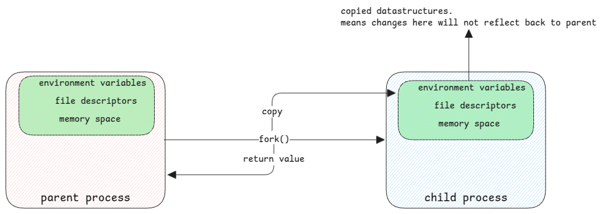

# Processes

It's important to keep in mind that kernel itself being a C program
that's being compiled to native code.

This means, all what kernel does is logic + data models defined in C structures.
Process is one such structure.

## Process/thread Structure

It's this structure **task_struct** that the kernel uses to manage the anything that must be executed.
This has all information related to the process such as PID, page table location,
register information such as current instruction pointer of the thread, etc.

:::important threads and processes
There is no big distinction between thread and process for the kernel when it comes to executing it.
In fact, kernel knows only threads.

Both are represented using the same structure.
This structure also has properties that links threads to main thread of the process.
:::

## Fork

Fork is the system call to start a process.

1. When we connect to a computer using SSH, then SSHD process forks a new process for the user's session.
2. When we execute commands then on the terminal, each command is executed via fork.
3. When we execute an OS command from a Java application, it will also fork a new process from the JVM process.

:::danger only init process is created without fork
When the OS boots, only the first process with PID 1 isn't booted via fork.

It's started by the Kernel and it then forks all other system services at boot.
:::

:::tip All commands are forks.
Even simple commands such as ps or ls are also fork in the background.
:::

### Process Duplication

When a process forks another child process, the fork() system call will always create a child process as duplicate of itself.

