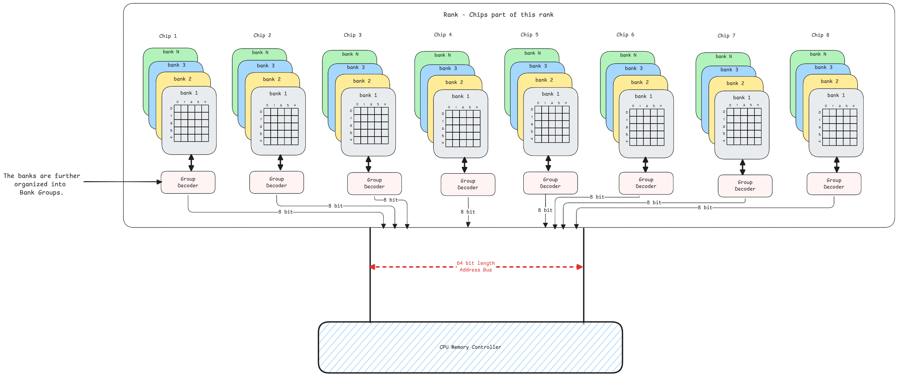

# RAM

Random Access Memory (RAM) is a type of computer memory that can be accessed randomly.
This means, any random byte can be addressed and accessed without any need to read the preceding bytes.

## Physical Properties

1. **Channels** - It's the number of data paths between the RAM and the CPU.
   More channels mean more data can be transferred simultaneously.
   Dual channel means two channels are used but we must use two identical RAM sticks for this to work.
2. **DIMM** - Dual In-line Memory Module is a type of RAM that has pins on both sides of the module.
   These pins work independently, allowing for more data to be transferred at once.
3. **Chips** - The chips on the RAM module are the actual memory cells that store data.
   In **dual-sided chips**, there are chips on both sides of the stick.
4. **Ranks** - It's just a logical division of the memory chips on the RAM module.
   The memory controller knows which rank to access for a given address.
   Each Rank is seen by CPU as a different memory module.
   **Each chip is part of only one Rank.**
   **This means the available chips are grouped into Ranks**.
5. **Bank** - Each chip is then divided into multiple banks.
   This is a physical division of the memory cells into 2-D arrays inside the chip.
6. **Bank Group** - It's a logical grouping of banks inside a chip
   but achieved by the physical dedicated circuits that allow simultaneous access to banks in different groups.

:::warning no firmware
The RAM stick itself doesn't contain any firmware.
There is just a serial presence detect (SPD) chip that contains information about the RAM stick,
such as its size, ranks, speed, and timings.
This information is used by the CPU memory controller.
:::

## Interleaving

This is the concept that uses the **Ranks** and also **Bank Groups**.

1. Request within same ranks but banks of different bank groups can be processed without waiting.
2. Request between two different ranks can be processed without waiting.

:::important dual channel and multiple ranks
With dual channel memory, the number of ranks increases.
This means, there are 2 memory sticks with 2 ranks each.
So, the 4 ranks and out of which 2 can be accessed at a time.
:::

## Address Translation

When the MMU returns the physical address of a location in RAM,
the memory controller then converts the physical address into a format that can be used to access the RAM chips.

This means, the generated address will be in the form of a rank, bank, row, and column.

:::danger same signal sent to all banks
When the address is decoded, all banks in the rank will get the same signal.
All banks will have the same row and column selected.

The values from all banks are concatenated to form the full 64 bit data.
:::

## Memory Cell

Each memory cell in the RAM is made up of a capacitor and a transistor.
The transistor acts as a switch that can either allow or block the flow of current to the capacitor.
It's used to read data from the capacitor or to write data to it.

:::info how transistor works
Transistor is a combination of transfer and resistor.
Only when the voltage is above a certain threshold, the transistor will allow current to flow through it.
This is how it can be used to read or write data.
:::

## Word and Bit Line

1. **Word Line** - It's nothing but the row in the RAM chip.
   When the address is decoded, the word line is activated to select the row.
   This means the all memory cells in that row is activated for reading or writing.
2. **Bit Line** - It's the column in the RAM chip.
   Based on the column address, the bit line is selected to read or write data.

:::tip memory matrix
The picture above shows only a small size of the matrix.
In reality, the matrix can be very large with many rows and columns.
:::

## Bus Size

In most modern systems, the bus size is 64 bits.
This means, the data transferred between the RAM and CPU is 64 bits at a time.
This is why the RAM chips are designed to have 64 bits of data in each rank.

But the CPU cache lines are 64 bytes.
So the RAM must transfer 8 times the data to fill the cache line.
This happens in bursts and multiple CPU cycles.
