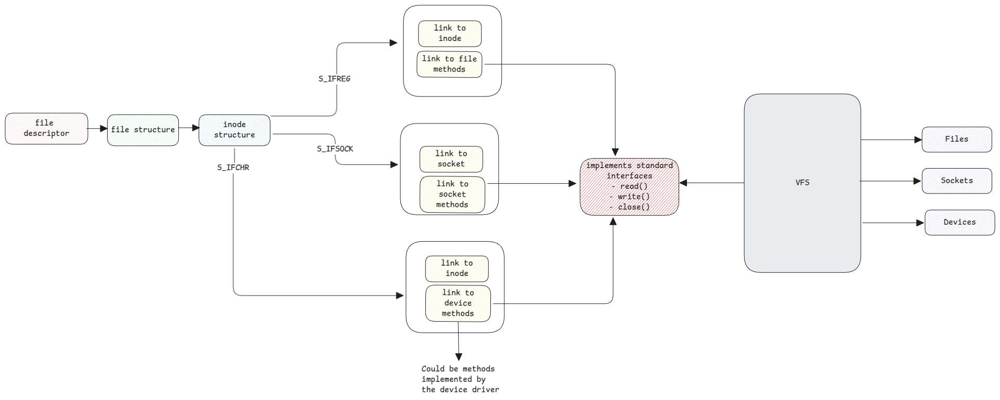

# File Descriptor

File descriptor is an integer that uniquely identifies an opened file or other I/O resource within a process.
It's used by the kernel to manage access to
files, devices, pipes (inter process communication), sockets( network communication) etc.

Essentially, anything that can be "opened" for I/O operations.

## C Structures

Every thread/process has **task_struct**.
This structure has a pointer to **files_struct** and
this is nothing but the file descriptor table.

This file descriptor table is just a map of file descriptor ID and
the pointer to corresponding **file** structure.

:::tip file structure
The **file** structure represents an open file.
It's also called the **open file description**.
It has pointers to the corresponding [**inode**](./inodes.md) structure and
also pointers to different operations that can be executed on it.
:::

This file structure then contains all necessary information such as the device's major number, minor number,
file location, file operations, permissions and also the pointer to inode structure of the this file.

:::info File descriptors are C objects
File descriptor are C objects created by kernel and remain in it's memory.
Only for uniformity sake, these values are also written to the file system under **/proc**.
:::

:::danger closing files
This why closing a file is important from userspace applications.
Otherwise the file descriptors remain open and will consume memory.
:::

## Sockets

File descriptors aren't just for actual files. It's also used for sockets.
Similar to how we use **open** method to get the file descriptor of a file,
we use **socket()** method to get the file descriptor of a socket.

In case of sockets, the inode structure has information about the source IP, source port,
destination IP, destination port, protocol, etc.
Both the client and server socket file structures need this information.

:::tip
Even though sockets are treated as another file but network devices aren't treated as block or character device.
This is because network adapters work completely different and use packets to communicate.
:::

## Device Files

These are files in /dev directory. They don't contain any data.
It only contains the major and minor number in its meta data which
defines the device driver that handles the underlying device.

This will include character files such as keyboards, mouse, printers, terminals, etc.
and also block devices such as hard disk, RAM, CD/DVD, USB, etc.

:::important All real interaction is via /dev
For writing/reading to any device, the writing or reading is always routed via the device located in /dev.
VFS uses the major and minor number from there to get the corresponding device driver
to execute methods on the underlying device.
:::

### Device Drivers

Any device driver must implement certain API methods defined by the kernel.
For communication across devices, the same API methods are called by userspace/kernel applications.

These are the methods then invoked by VFS.

:::info Useful links

- [File Descriptor and Open File Description (biriukov.dev)](https://biriukov.dev/docs/fd-pipe-session-terminal/1-file-descriptor-and-open-file-description/)
- [Bottom Up Computer Science: File Descriptors](https://bottomupcs.com/ch01s03.html)

:::

## VFS

VFS is involved for all actions that happens via the file descriptor.
It's the VFS layer that extracts the functions linked to the file descriptor and executes them.
