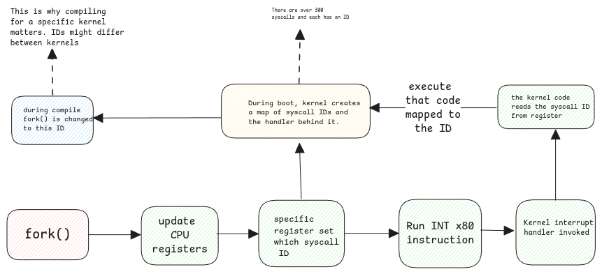

# System Calls

## Compilation Process

Whenever an userspace application wants to interact with kernel,
then it has to go via the system call process.
So the program with a simple **fork** or **open** calls will interact with C methods.

:::tip native code
Native code means a code that's compiled to run a specific OS and CPU instruction set.
This is mostly the machine language implemented using the CPU'S instruction set.
:::

:::important C Libraries
Linux is written in C and
so the kernel developers also deliver userspace C libraries
called **glibc** to interact with the kernel.

So when writing C programs,
these libraries can be used by other user applications to do system calls to kernel.

Consider the methods in these libraries as wrappers to the actual native functions.
:::

## Execution Process

Execution of a system calls involves setting up of CPU registers
with the ID of the system call handler method which will then be used by the kernel interrupt handler.

:::info interesting reads

- [System Calls - manybutfinite.com](https://manybutfinite.com/post/system-calls/)

:::
