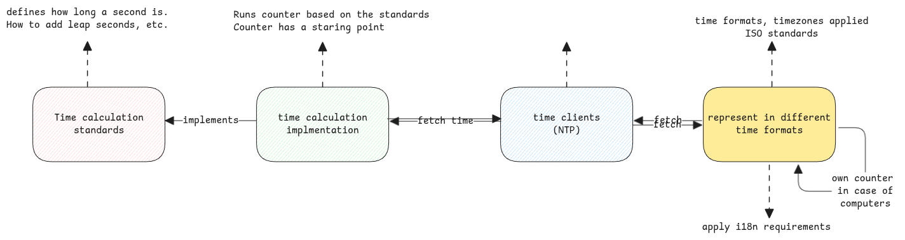

# Time

In programming, it's always confusing about the time zones, time formats, etc.
Moreover some terms are used interchangeably unknowingly.

## Time Calculation Standards

Here time calculation standards means, the set of rules to calculate the current time.

1. **GMT** - This is the astronomical way of calculating time based on sun's location at Greenwich city.
   It uses sun's position to define the current hour, minute and second.
   This isn't used anymore.

2. **UTC** - Co-ordinated Universal Time.
   This is the new standard and the only standard used at present.
   In this standard, they define duration of a second based on
   how many times an atom needs to vibrate to consider it a second.
   This is the most accurate standard at the moment.

:::important UTC is just like a stop watch
The clocks implementing UTC, just keep counting seconds from its start time.
It's the responsibility of the clients to convert this number of seconds elapsed value into calendar data and time.

This exactly why the epoch time is just a long value.
It's the number of seconds elapsed from 00:00::00 Jan 1, 1972.
:::

:::tip Time standards and Time zones
UTC or GMT doesn't have the concept of timezone.
It's applied on the client side only.
:::

## Time Implementation

GMT and UTC are just standards.
The implementation of it generates the time and is used by systems such as NTP, GPS etc., as an original source.

UTC is implemented by many labs across the world,
which is then **co-ordinated** by a central lab to provide the accurate time lapsed.
These time sources then provide the exact seconds counter value,
which is then used by clients to interpret it as they would like.

:::warning Unix time is another implementation
Unix time is the implementation where the server uses hardware timers on the motherboard to keep seconds counter in memory.

When the server boots, it first takes the UTC time from NTP server which is epoch from 1972.
The server then takes this value and adds more **seconds** to move the epoch to 1970
and then starts it's own counter again the last fetched value.
This is exactly why the server time continues to run even when there is no network connection.
:::

:::danger time on Unix
So on Unix, whenever we ask for the system time, it always returns whatever the Unix seconds counter shows.
Only at certain intervals, the system synchronizes and corrects it's time from an NTP server.
:::

## epoch

This is the start time when the timer's counter has started.
Every time source always says only the number of seconds elapsed from this epoch point.

:::info meaning of epoch
Meaning of the word **epoch** in English itself means a fixed point in time from which a new era or period is measured.
:::

## Time Formats

Once the time, that is, the number of elapsed seconds from the epoch is fetched,
we can represent it in calendar format that humans understand.
We apply timezones, date, hour, etc., to it.

:::important ISO format
ISO 8601 is now such standard which represents the UTC is an human-readable and machine friendly format.
It doesn't add any timezones. The location based changes must be then added by clients as part of i18n.
:::
