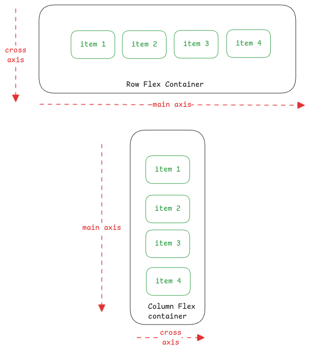

# Align vs Justify Items

One of the most confusing things for me and also frequently forgotten is
how align-items and justify-content options work in CSS and when to use which one.

:::important[Flex Only Feature]
Both **align-items** and **justify-content** options in CSS are only for flex containers.
They control the position of the items within a flex container.
:::

## Justify Content

Used to control the position of flex items over the **main axis** of the flex container.

## Align Item

Used to control the position of flex items over the **cross axis** of the flex container.

For example, when you want have a row direction flex,
using align-items option, we can place all the horizontal items at the same vertical level.

## Justify and Align Individual Items

The options above are valid for all items in the flex container.
But **justify-self** and **align-self** can be used to control the position of a specific
flex item on main and cross axis respectively.

:::info[useful links]

- [Align Items and Justify Content - OpenClassrooms](https://openclassrooms.com/en/courses/5295881-create-web-page-layouts-with-css/5415181-align-items-and-justify-content)

:::
