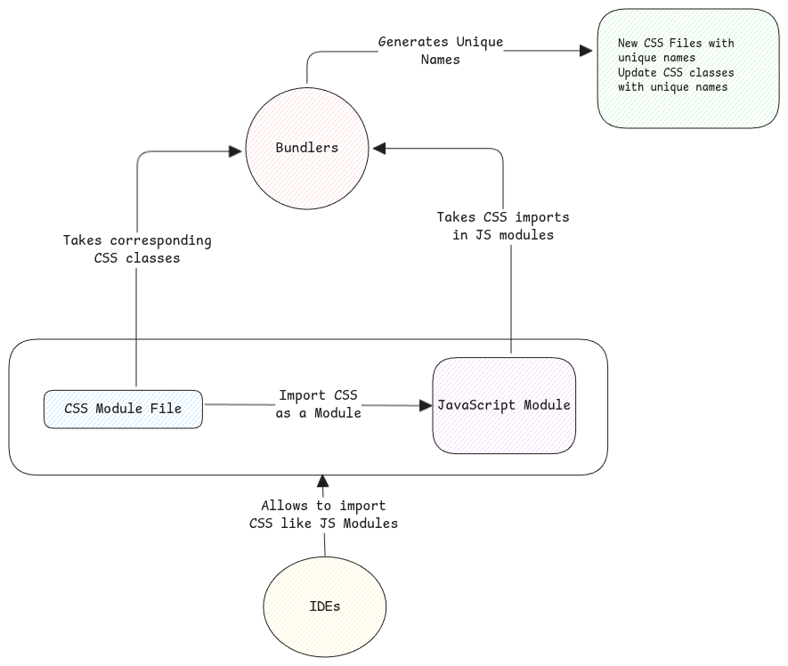

# CSS Modules

CSS Modules isn't a CSS language concept. Its 'a concept built into bundlers and IDEs.

:::tip[Why The Name]
It's called as CSS Module because the CSS file behaves like a JavaScript module.
Which means, all classes are local to that file. They're not available in the global CSS scope.
:::



## CSS Global Scope

In CSS, all CSS classes are global by default. This means -

1. All selectors are executed across the complete HTML tree. All matches across the complete document will be updated.
2. Duplicate class names will cause unexpected issues.
   Developer must ensure that the class names are always unique.

## Loading CSS Modules

Each CSS file is loaded as a JavaScript object with each class as the object's property.

### How bundlers resolve

When the bundler parses a JavaScript file and it sees a import of CSS in the below format,
it will assume that the CSS is imported as module.

Then it will take out only the classes from the CSS file referenced in this JavaScript file,
gives random names to the classes and
generate a separate CSS file with random name for this JavaScript file in the bundle.

This means, even if there is duplicate class names, the exact imported one is only used in the exported bundle.

```javascript
import styles from 'css/styles.css';
```

:::tip[Webpack and Vite]
Webpack and Vite consider all CSS files with extension **.module.css** as CSS module files.
These CSS files never make it to the final bundle in the original form.
:::

### How IDEs help

IDEs help to resolve CSS class names as properties of the CSS module.
They treat CSS imports as regular JavaScript module imports.

They don't show warnings that a CSS class name is invalid.
