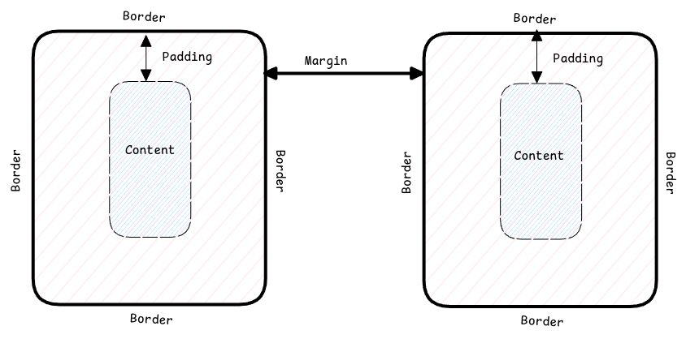

# Margin vs Padding vs Border

Unfortunately this been one of my very confusing topics always.
I look up the definition of these 3 parameters every often on internet.

Margin - It's the space between two elements. It's outside the element's border.
Padding - It's the inside an HTML element. It's from content to border.
Think of it as the extra "padding" provided to content to increase its space in the page.
Border - It's the fence of the element. It's the area around content + padding

:::important Margins Auto Collapse
Both margin and padding helps to add space between elements.
But margins between two vertical elements auto collapse.

This means, if two vertical elements having a margin of 1em,
then the overall margin between these two elements will be 1em only.
:::

## Auto Margin

This will automatically place the content in the center of the container
or the width of the container.
