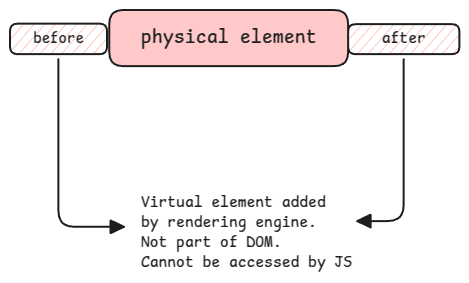

# Pseudo Elements vs Pseudo Classes

They're called **pseudo** because they don't exist really in the DOM.
It's just logical.

## Pseudo Elements

It's described using **::** symbol and with a **content** property.

In the CSS, first use regular selector to select an existing element in the DOM and
then by adding ::before or ::after, the value provided in the **content** property will be added before or after the content of the selected element.

When we look at the DOM, these virtual elements that are added using before and after
are simply considered as child elements of the physical element to which it's added.

:::info Available Pseudo Elements
first-letter (**content** from the pseudo element will be added to the content of the first letter),
before, after, first-line (**content** from the pseudo element will be added to the content of the first line),
selection and many more.
:::

### Without Content

The **content** property is mandatory field. But it can set with empty string.
Such solution is then used to just add some colors or designs to an existing element.

:::danger Pseudo elements in DOM
when the DOM is inspected using the browser tools, the pseudo elements are simply shown as child element with the element name.
Eg., as **::before** and clicking on that will show the corresponding CSS snippet behind it.
They don't have their own HTML tags.
:::

## Pseudo Classes

These are ways add selectors to filter based on a specific interaction state of an element or its position in the DOM tree.

It's described using **:** symbol.

:::info[Available Pseudo Classes]
hover, focus, invalid, nth-child and many more.
:::

## Combining Pseudo Elements and Classes

It's possible to combine pseudo elements and classes.

A good example is **::hover::after**. In this case, after the element is hovered, a new virtual element is added/styled next to the element.

:::tip[useful links]

- https://ishadeed.com/article/clickable-area/
- https://girlthatlovestocode.com/css-pseudo-elements-before-and-after

:::
