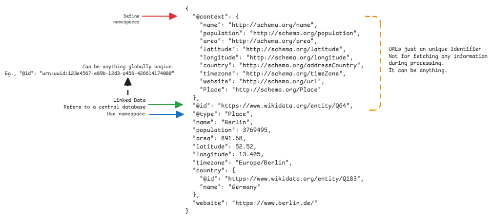

# JSON-LD

JSON Linked Data is a JSON based payload where

1. Data can be referred/linked from other sources.
   This will ensure that same data is referred from multiple places.
   This is the **@Id** field in JSON-LD.
2. Meanings of data can be central.
   The field name can be anything, but we just say what it means by using **@context**.
   This is where the word **machine-understandable** comes from.

:::tip Why JSON-LD?
It's mainly for global interoperability of data across different systems.
For example, multiple organization can share common data definitions in a central place
and refer to them in their own data models with any names they wish.
:::

## JSON-LD and RDF

RDF (Resource Description Framework) is a data model for linked data.
Which means, it allows us to represent data as a graph of relationships.
RDF represents data as triples: subject, predicate (property/relationship), object.
Everything is a 3-tuple.

- Every entity (subject or object) can be identified globally via a URI. (IDs)
- Predicates (properties) are also URIs, giving them precise, machine-readable meaning (Context).

JSON-LD is one of the serializations of RDF.
So JSON-LD is a way to represent RDF data model in JSON format.

:::danger example mapping
**subject** is the @Id in JSON-LD..
**predicate** is the field name.
**object** is the field value.

**NOTE**: @type is a special predicate in RDF which is also used in JSON-LD.
:::

## Differences to JSON Schema

1. JSON schema is about specific data model with constraints and validations
   while JSON-LD is about linking data across different sources.
2. JSON uses fixed field names.
3. JSON can't refer to external data
4. HATE-OS in REST APIs only provide URIs to access data, but not the data itself.

:::warning different from Hate-OS
In Hate-OS, the clients must use the links to fetch or do other actions on the resource.
But in JSON-LD, they URIs just refer to other resources from other sources.
The clients can still use the data in the payload directly.
:::

## Important Fields in JSON-LD

- **@context**: defines the meaning of different properties of the object.
  Usually every field has a context defined. The context can be defined locally or refer to an external source.
- **@id**: defines the unique identifier of the resource.
  This refers to any resource, anywhere on the web or local.
  It's the **subject**.
- **@type**: defines the meaning/type of the object itself.
