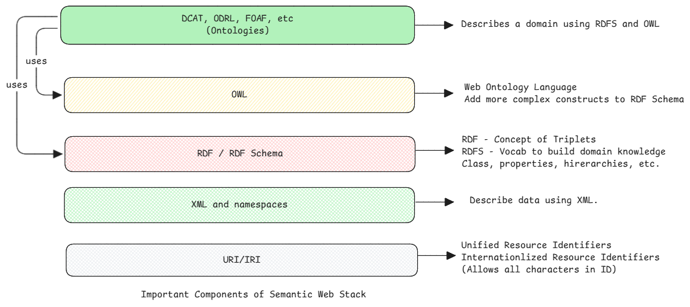
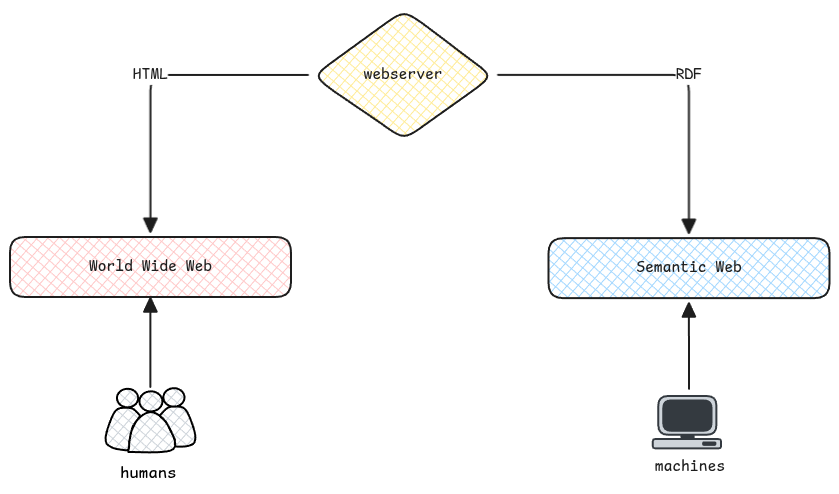

# Semantic Web

The word **web** in the semantic web is what confuses and misleads mostly.
It must be read as **web of semantics**.
Meaning, it sees the internet as a web of data which can be understood by machines.

Semantic Web topic contains multiple topics which are aimed at expressing
and exposing understandable and linkable data.

## Semantic Web vs WWW

Semantic web is better understood when we compare it with world wide web.

<!-- markdownlint-disable MD013-->

| Aspect        | World Wide Web (WWW)                            | Semantic Web (SW)                                         |
| :------------ | :---------------------------------------------- | :-------------------------------------------------------- |
| **Focus**     | **Documents** (HTML pages)                      | **Data** (Facts about things)                             |
| **Structure** | **Hyperlinks** (links between pages)            | **Linked Data** (links between _concepts_ and _entities_) |
| **Result**    | A vast, distributed **library** of information. | A vast, distributed **knowledge graph** or **database**.  |

<!-- markdownlint-restore-->

## Consumers of Semantic Web

The consumers of semantic web are mostly machines and hence the data must be understandable by machines and
also applying logical reasoning must be possible.

:::tip example of logical reasoning
Assume a ontology provides this data using [RDF triplets](json-ld.md#json-ld-versus-rdf).

- All dogs are mammals
- All mammals are warm-blooded
- Fido is a dog

With logical reasoning rules, a system can automatically conclude: "Fido is warm-blooded"
:::
