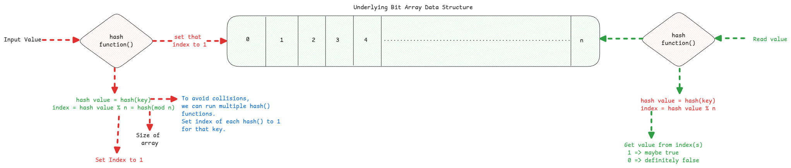

# Bloom Filters

:::warning Origin of the Name
The name Bloom comes from the name of the scientist **Burton Howard Bloom** who invented this.
:::

## Why we need bloom filters

It's used for use cases where storing information in a traditional database is too expensive or impractical
and we only need to check if an specific condition is true or false.

:::important Membership check
The main use case of Bloom filter is the **membership/presence proof** check.
Which means, this data structure is used to check a specific condition is **definitely false or a may be true**.
:::

Assume an example where YouTube needs to know which user has seen which shorts already,
so that the same short isn't shown again.
Given the fact that there are millions of users and billions of shorts,
it's impractical to store this information in a traditional database.

- **set** - We will need one set for each user and
  search in the set is 0(1) time but the size of the set will be too big.
- **binary tree** - We will need a big tree meaning, we will be spending too much memory for just holding the internal nodes.
- **database** - If number of users is 1 million (10⁶) and number of shorts is 1 billion (10⁹),
  then the total number of entries in the database would be 10¹⁵.

:::tip trade-off provided
This data structure provides space and time efficiency but correction loss.
:::

## Implementation

Bloom filter is based on **bit array**.
This means, if we want to store information about 1 million data then it just needs 1 MB memory.

:::danger Collisions and may-be true
If the **hash()** value of multiple keys leads to same key or keys,
then the same data represent multiple keys.
This is exactly why when we read the data for a key, then the output is **probably true** .
But when for a key, if the index isn't set to '1', then the output is **definitely false**.
:::

## Hash Functions

We need not use strong and expensive cryptographic hashing functions such has SHA or MD5.
Instead use hashing algorithms such as Murmur.

If we want to use multiple bits to represent a key,
then we can use multiple hash functions and pass the same key to it.
Then use the output of each of them to represent a key in the bloom filter.

## Size of Bloom filter

It's necessary to decide the optimal size of the filter at the beginning itself.
There is a standard formula that describes the parameters that must be considered.

Formula to calculate filter size can be found [here](https://hur.st/bloomfilter/).

:::warning changing size of Bloom filter isn't easy
Changing size of Bloom filter isn't straight forward.
We can't simply create another bigger bit array and copy the data there
because if we change the array size then the 'mod' value also changes.
So the existing calculations become invalid.
:::

## Use cases

We can consider any case where it's important to confirm a 'false' check
or any case where it's fine to have a small probability of wrong 'true' check.

1. Check if username is already used.
2. In databases to avoid query to DB.
3. Caching.
4. CDN - avoid calls to origin.
5. Many more.

:::tip use bit vectors for reading values
Refer to the [bit masking](../algorithms/bit-masking.md) and
[bit vectors](../computers/bit-manipulation.md)
to understand how bits can be read from the bloom filter.
:::
