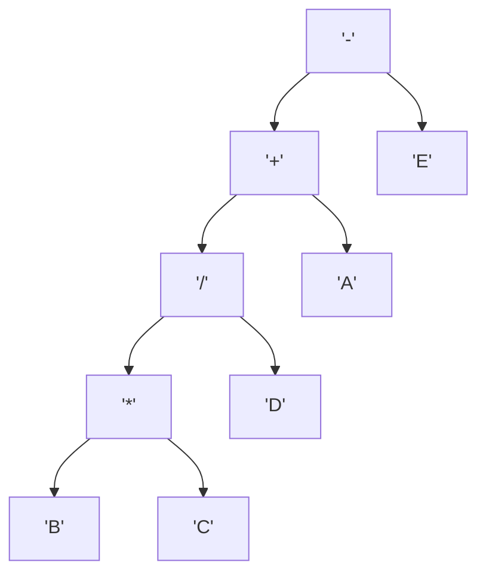

# Expression Trees

An expression tree is a binary tree where each internal node represents an operator
and each leaf node represents an operand (like a number or variable).

This is used in parsing and executing mathematical expressions in compilers and interpreters.

## Expression Parsing

When an expression needs to parsed, the expression tree is built first.
This is built using the BODMAS principles and splitting the operands.

:::important using binary trees
We can use any binary tree to represent the expression.
Preorder, Inorder or Postorder traversal can be used to evaluate the expression.
:::

Important is, it's the role of the compiler to generate the correct expression tree
even when there are brackets and then let CPU execute the parts of the expression in the correct order.

Sample Expression - A + B \* C / D - E

