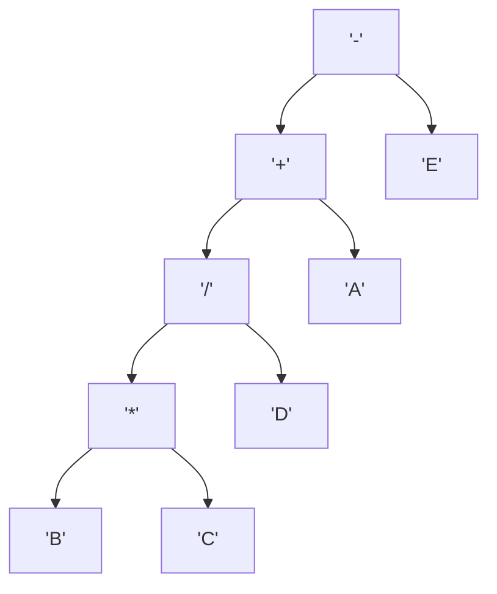

# Expression Trees

An expression tree is a binary tree. Each internal node is an operator.
Each leaf node is an operand, such as a number or variable.

Compilers and interpreters use it to parse and run math expressions.

## Expression Parsing

To parse an expression, you build the tree first.
You build it with the BODMAS rules and split the operands.

:::important using binary trees
Any binary tree can represent the expression.
You can use preorder, inorder, or postorder traversal to evaluate it.
:::

The compiler must build the correct tree, even with brackets.
The CPU then runs the parts in the right order.

Sample Expression - A + B \* C / D - E

