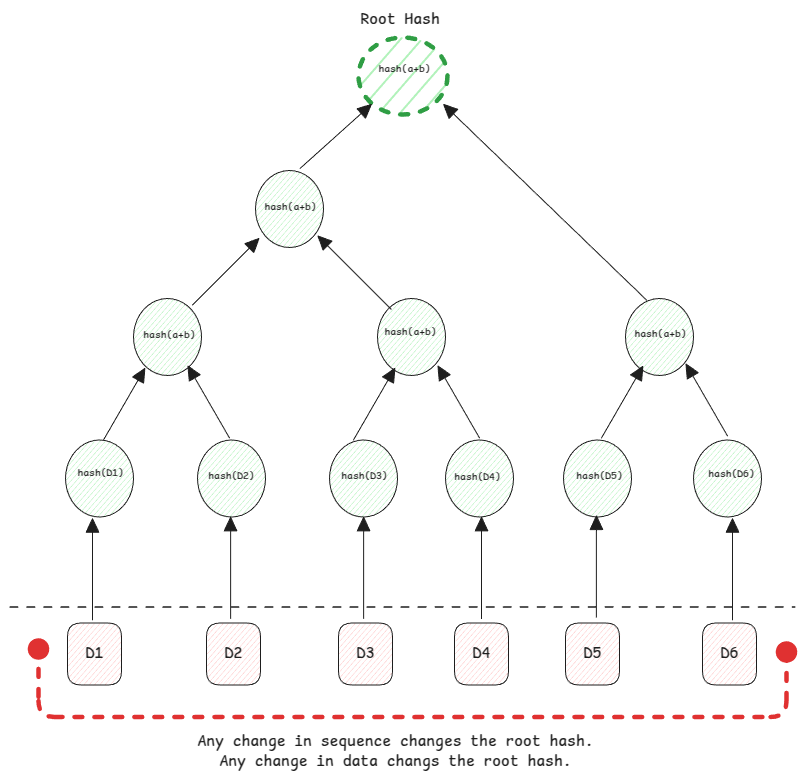

# Hash Trees

Hash tree is a data structure where the leaves of the tree are nothing
but the hash values of it's children.

1. The entire tree doesn't hold any data. It only holds the hash values of data stored somewhere else.
2. Number of child nodes describes the size of the hash tree.
3. The hash algorithm used to hash the data isn't relevant for this data structure.
   It's left to the implementer to decide it.

:::important Practical use cases

1. Bitcoin - uses this to create a Merkel root of the data in the block.
2. GIT - Uses this to create an hash of an commit by generating the hash of the entire repository.
   :::
