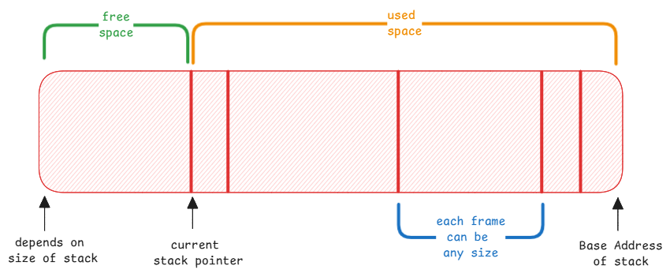

# Stacks

Stacks are based on LIFO (Last In First Out) data structure.
The last element added to the stack is the first one to be removed.

Stack is preferred for use cases where the write and read need O(1) time complexity.
It's because all happens using the current pointer to the top of the stack.

:::danger It's all virtual
There is no real stack in the computer.
The stack is just a logical structure that's implemented using arrays or linked lists.

But important is, the top most address of the stack is **tracked**.
:::

## Stack Operations

Whenever we say **push data**, the top address is incremented and the data is added at that address.
When we say **pop data**, the top address is decremented and the data is removed from that address.

:::warning Stack Overflow
If the stack is full and we try to push more data, it results in a stack overflow.
:::

## Frame concept

Even the frame concept is just virtual.
It's left to the application to decide how to use the stack.
You can ideally push any data and move the pointer.

**Frames are just boundaries created by RBP**.

:::important Offsets to access data
The offsets are used to access the data in the stack.
There is no specific size for each frame of the stack.
The application popping must know how much data to pop.

Also, this applies to the POP statements in assembly language as well as bytecode instructions in higher level languages.
:::
