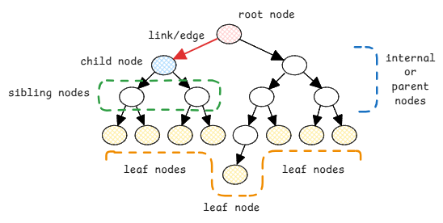
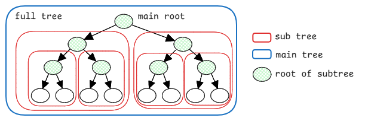

# Trees

Trees are hierarchical and non-linear data structures.

:::tip tree is inverted
The most important mental model is to understand that
the trees in computer science are inverted compared to real-life trees.
The root of the tree is at the top and the leaves are at the bottom.
:::

## Characteristics of Trees

- **Root** - This is the top most node of the tree.
  There can be only one root node in a tree.
- **Link/Edge** - This is the connection between one node to another node.
- **Parent or Internal Node** - A node that has a child node.
- **Child Node** - A node that has a parent node.
- **Sibling Nodes** - Nodes that share the same parent node.
- **Leaf Node** - A node that doesn't have any child nodes.

## Recursive Nature of Trees

Trees are recursive data structures.
Means a tree is made up of smaller trees.
So every small tree also has the same characteristics as a big tree mentioned above.

:::important recursive programming
This is exactly why we use recursion to traverse trees.
Specially in [binary DFS traversals](../algorithms/binary-tree-transversals.md#depth-first-search-dfs)
(preorder, inorder, postorder),
we recursively work on sub trees until we reach the leaf nodes.
:::

## Depth and Height of Trees

- **Depth of a node** - The number of **edges** from the root node to that particular node.
- **Height of a node** - The number of **edges** on the longest path from that node to a leaf node.
- **Height of the tree** - The height of the root node.

<!-- vale Microsoft.Dashes = NO  -->
<!-- vale Microsoft.Negative = NO  -->

:::important height is max of children
Max height of it's children **+1**.
We just calculate the height of the children nodes,
take the maximum of those heights,
and add **+1** for the edge connecting from that node to its child.

Just pure recursive calculation.
:::

:::warning depth and height mental model
We must consider it by reversing the tree.
Then this becomes easier to understand.

So depth is then how deep the node goes until the root
and height is how high the node is up to the farthest leaf.
:::

### -1 for height of empty tree

Whenever a node has specific sub-tree empty, we consider the height of that empty sub-tree as -1.
This is exactly why the leaf nodes have height 0.

A leaf node has no children. So it's -1 each side.
max(-1, -1) + 1 = 0.

1 is always added as explained [above](#depth-and-height-of-trees).

### +1 for edge connecting to child

Whenever we calculate the height of a node,
we first recursively calculate the height of its children.
Then we always add **+1** for the edge connecting the node to it's child.

So if a node has a child with height h,
then the height of the node itself will be h + 1.

:::important height calculation for leaf nodes
For leaf nodes, since they have no children, their height is 0.

Since both left and right child is null, we consider their heights as max(-1, -1).
Then height of leaf node = max(-1, -1) + 1 = 0.
:::

:::danger +1 is just an arbitrary convention
This +1 convention might look a bit confusing at the first time,
since we also add +1 for a leaf node which doesn't have any edge connecting to child.
But this is the standard convention used in algorithms for defining height of trees.

This makes sense because, we use **-1** when no edge connects to child.
And recursively, we can use one single formula for all nodes.
:::
