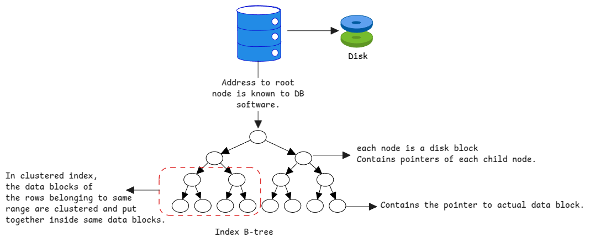

# Indexes

Like we learnt in the [disks](../storage/disks.md#physical-vs-logical-sector-size) section,
the storage is split into blocks and all IO happens at the block level.

This means, when a row is written to disk, we must read the entire block
and then update its content and write back the entire block to disk
and if we need to read this row again,
we need to load all blocks into memory and then find out which block contains the row.

With index, we only load the index data into memory
and then we can find out the block which contains the row.
The index is a data structure which contains the mapping between the row
and the memory address of block on the disk.

## Data Structures for Indexes

With the invent of b-trees, the indexes are now stored in a tree structure.
This means, we can traverse the tree to find out the actual disk block which contains the row.

:::tip why b-trees
b-tree provides a log(n) time complexity for searching, inserting and deleting.
This is much better than the linear search which has a time complexity of O(n).

This is necessary because every add, delete and update must update the index tree as well.
:::

## Size of B-tree Nodes

Each node of the B-tree is again size of the disk's block size which is also known as page size.

This means, the number of child node addresses each index node can store
depends no the size of the block.

:::important read b-tree
Even though b-tree is a data structure,
the full b-tree isn't serialized onto disk or de-serialized into memory.

Instead, only the root node of each index is stored in a specific location where all metadata is stored.

After that each child node is loaded from disk based on the query.
:::

## Clustered Indexes

It's the type of index where the data is 'clustered' together in the order of index.

If an index node in the tree points to a specific range of key,
all the data in that range is stored in the stored together.

## Non clustered Indexes

In this type of index, the data isn't stored in order.
They can be put in any data block.

:::warning Only one clustered index
There can be only one clustered index per table because it controls the location of the data.

All secondary indexes are non clustered indexes.
:::
