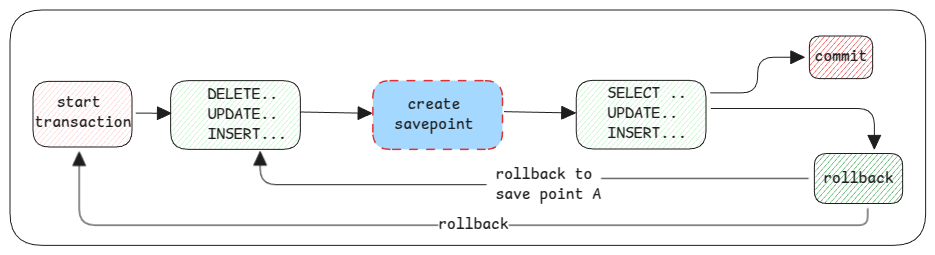

# Save Point

Save point is a SQL feature that can help us group queries in a transaction before doing a commit.

::: important rollback is only before a commit
Rollback is a feature that can be used only before a commit.

If a commit is done, then we can only use DELETE statements to remove changes.
:::

