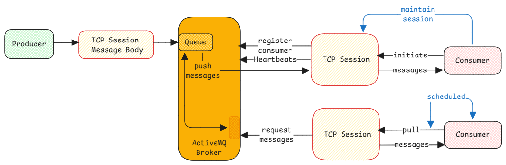

# RabbitMQ Data Transfer

In RabbitMQ, the consumer doesn't pick up messages from the queue like I assumed.

When the consumer starts and connects to the broker, there is a TCP connection established.
Whenever there is a message for the consumer, the broker then pushes the message using the
same TCP session.

:::important[supports both push and pull]
RabbitMQ supports both push and pull data transfer.
But default is the push mechanism.

Even though pull is supported, it isn't recommended.
For both push and pull mechanism, the TCP session must be initiated by the consumer.
Broker doesn't start any sessions.
:::

## Multiple Consumers

When multiple consumers exist, then the broker keeps track and pushes the message
on different consumer TCP connections in a round-robin model.

## Producers don't need sessions

Producers need not keep an active TCP session always.
They can simply start a new session, send messages to the broker and close the session.

An active TCP session need not be maintained using heartbeat or pings.

## Topic Exchange

Necessary when a same message must be sent to multiple consumers based on conditions (routing-key).
