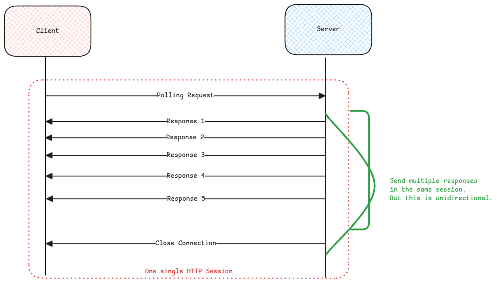

# Polling Methods

:::info[Session initiation only from client possible]
We need polling because only the end user /client can send request to web server and ask for data.
Whereas the server can't initiate an HTTP connection from it's side to end user's IP address to pass data.
:::

## Long Polling

The server doesn't respond to the polling immediately. Instead holds the HTTP session until a change occurs and then responds.

## Short Polling

Responds immediately to the polling request with whatever update it has.

## Server Sent Events

Starts one single HTTP session from client and the server uses the same session to send multiple responses.
This is unidirectional way of sending multiple responses back to the client.

:::important[difference between standard HTTP request and SSE]
Difference is the **Accept** and **Content-Type** HTTP header.
Value should be **text/event-stream** so that server and client understands that it's a SSE based communication.

and the response messages always have **Transfer-Encoding: chunked** which means multiple responses can
be expected.
:::

## Websockets

Starts with one HTTP session from client to perform an handshake with server to start a websocket protocol based session.
After that the client and server communicate with each other using the **ws** protocol.
This is a bi-directional way of sending multiple requests and receiving multiple responses using the same HTTP session.

:::tip[Websocket use]
Websockets are mostly used in chat based communication.
:::

:::danger[Websocket protocol blocked]
Since websocket uses its own protocol, mostly firewalls and load balancers can block them
and it needs special configuration to handle them.
:::

## keep-alive Connection Header vs Server-Sent Events

**Connection: keep-alive** HTTP header is to decide how the TCP layer 4 connection is handled between
server and client.

Here it means that the layer-4 TCP connection will be kept alive even after the HTTP session is closed.

:::[danger](Multi Node Clusters)
In case of polling, we must always consider that in a multi-node cluster the processing can happen on
any node. So the node processing the polling request from the client must ensure to fetch data from
a centralized system such as database.
:::
