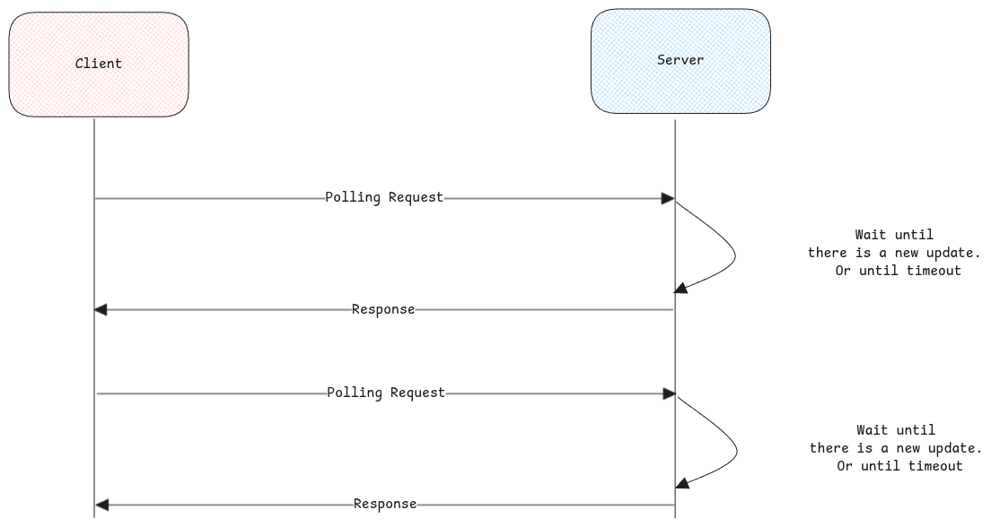

# Polling Methods

:::info[Session initiation only from client possible]
We need polling because only the end user /client can send request to web server and ask for data.
Whereas the server can't initiate an HTTP connection from it's side to end user's IP address to pass data.
:::

## Long Polling

The server doesn't respond to the polling immediately. Instead holds the HTTP session until a change occurs and then responds.

## Short Polling

Responds immediately to the polling request with whatever update it has.

## Server Sent Events

Starts one single HTTP session from client and the server uses the same session to send multiple responses.
This is unidirectional way of sending multiple responses back to the client.

## Websockets

Starts one single HTTP session from client and using the same to receive new messages from server and also to send multiple messages to server.
This is a bi-directional way of sending multiple requests and receiving multiple responses using the same HTTP session.

:::tip[Websocket use]
Websockets are mostly used in chat based communication.
:::

