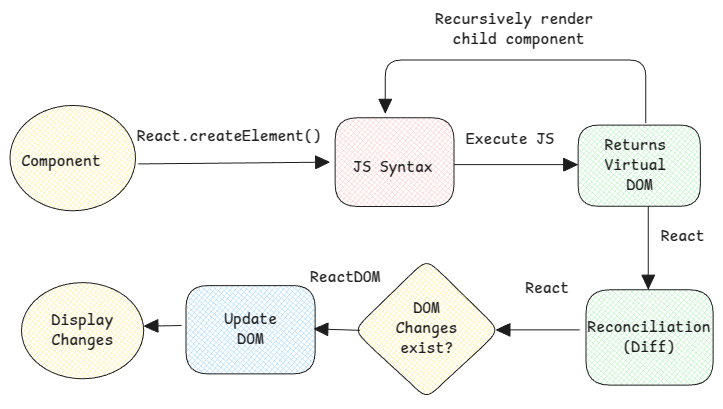

# Rendering vs Updating DOM

Rendering and updating DOM are two completely different things.

Rendering is where the React library executes a component and generates the output of the component function.

Correct mental model to consider here is that the rendering is a **recursive** process. This means, if the rendering
a component contains another component, then that component will be rendered. This will be done until all custom
components are rendered. React uses the `type` field in the rendered output to check if the child tag is a
custom component or a native HTML tag. `type = function` means it's another component that must be rendered additionally.

:::info
Custom components are all component names that start with uppercase. The lower case tags in JSX are considered as
native HTML tags by React.
:::

This rendering process is what that generates the virtual DOM as well.

ReactDOM library then uses the virtual DOM to generate the actual HTML code and update the real DOM.

## Render ≠ UpdateDOM

It's very important to know that even though every render generates a new virtual DOM
but this doesn't mean that the DOM will be updated.

React diffing algorithm is called **reconciliation** will be used by React to check if there are any DOM changes.
If there are any changes, then the changes are handed over to ReactDOM which will then update the real DOM.

:::tip

1. React.createElement - converts JSX to JS.
2. When element is rendered - the out of the JS function is a virtual DOM object.
3. In RSC, this virtual DOM object is what's converted to String and sent to the client.
   :::

:::info
https://www.robinwieruch.de/react-element-component/
https://stackoverflow.com/questions/73326943/who-converts-react-createelement-into-html-tags
https://react.dev/learn/render-and-commit
:::
