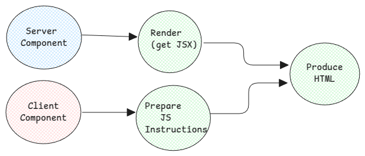

# React Server Components

In case of SSR, the problem has been that the server has to wait for client scripts to be downloaded and hydrated.
Until then the web page isn't really usable.

In case of RSC, when a page is requested the following happens

1. Prepare the complete component tree - including server and client components.
2. Render all components and generate HTML
3. Prepare JS instructions for client components.
4. Stream RSC payload for all suspended components.

:::note
Components in RSC can be also a async (Methods that return Promise).
:::

## RSC streams JSX

Most important mental model about RSC is, the HTML is rendered on server and to this same HTML, the RSC payloads
are also streamed.

The static HTML is returned to be immediately displayed on the browser and then starts to stream the suspended
components using RSC payload.

### Why Streaming JSX

With SSR, the HTML was streamed directly. But with RSC, a new JSON based payload was defined.

This is necessary since the server always renders the full HTML and this will rewrite everything on the DOM and
we will lose state when browse through the webpage.

And for React to know and change only the exact elements that has changed, it must know the full react tree.
Constructing a React tree out of HTML is a heavy operation. Instead, the React tree is generated on the server,
and it's directly sent.

What this means is, the first page in RSC is an SSR generated HTML but together with this, RSC also ships the root
JSX for this page. And all subsequent JSX received from server will be used to update this original root JSX and
eventually also the DOM. Using this, the state isn't lost, and React only replaces/adds components which were newly received in the streamed JSX.

#### Advantages

1. API calls need not be generated from browser. It can happen directly from the server.
2. Heavy NPM packages aren't anymore part of the client bundle. The packages are only on the server,
   and they're directly used on server to render components.

### Stringify JSX Data a.k.a RSC Payload

1. By default, the root component is always a server component in RSC.
2. And by default, every component is a server component. Only client components must be explicitly declared using the
   `use client` directive.
3. Client components are simply exported as regular client scripts as it's done with CSR.
4. The RSC payload contains the
    - JSX serialized data for server components
    - Placeholders for scripts of client components which are used in the server component.
    - Scripts of client components.

:::tip
The JSX is serialized using the same `React.CreateElement()` function to get the serialized form of JSX. The same
React client library is used here to generate it. It will recursively go from the requested route to the inner most
component to generate the complete React tree.
:::

## Client Boundary

The boundary starts from any component that has the `use client` directive. It then covers all imports the file has.

So as long as the client component has very small and minimal imports, the boundary is limited.

## RSC with SSR

RSC and SSR are two complementing features and is used together. For example, if React knows that a particular server
component depends only on static data, then it will directly render HTML.

:::tip
**React Client** is any software that consumes the output of **React Server**. It need not be a browser.
For example, SSR consumes the output of RSC and generates HTML. So even SSR is considered as a React Client.
:::

##### Notes

1. Separate memory spaces - browser-server. This why serialization (JSX in RSC) is needed.
2. Serialize it on server and de-serialize it on client.
3. React tree - server and client component interleaved.
4. RSC payload is part of the page payload.

:::info
content inspired and curated from

-   https://github.com/reactwg/server-components/discussions/5
-   https://github.com/reactwg/server-components/discussions/4
-   https://www.plasmic.app/blog/how-react-server-components-work
-   https://www.mux.com/blog/what-are-react-server-components
-   https://unicorn-utterances.com/posts/what-are-react-server-components
-   https://www.webscope.io/blog/server-components-vs-ssr
-   https://www.smashingmagazine.com/2024/05/forensics-react-server-components/
    :::
