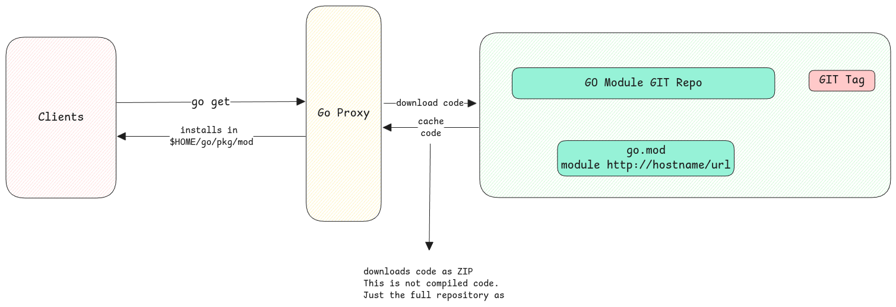
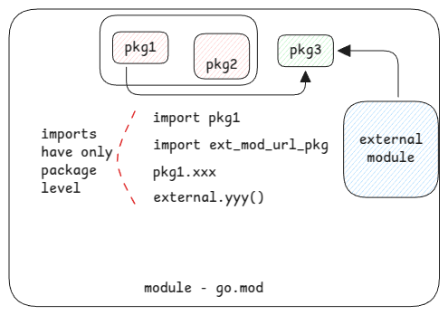

# Go Modules

The biggest difference with **Go Modules** when compared with how Maven or Gradle in Java works is that,
Go uses the GIT repository itself as the place to host modules.

So unlike Java, the code isn't compiled and uploaded to some central repository.
The code remains **decentralized** in the GIT repositories.

## Modules, Packages and Imports

1. Module is the main application or the library.
2. Under modules there can be 1:N packages.
3. Imports always stop at package level. We import packages. Nothing below that.
4. All go source files inside a package are accessible to each other without making
   any thing public.

:::important[Different package name in same folder]
The package name in the go files must be same for all go files under one folder.
Otherwise there is a compile failure.
:::

## Accessing imported code

Accessing of all public code from the imported package then happens via the package name.

We just put the package (folder) path and then use ´packageName.xxxx´ to access them.
No need to even specify the package name. It's automatically taken since all the go
files under a folder have the same package name.

:::tip[Alias for package names]
If the package name taken from the important package isn't good or doesn't fit to your
coding standards then we can add an alias in the import.
:::

### Packages on the root folder

For go files which are directly put under the root folder of the module, there is no special **pkg** folder needed.
But all go files must have the same package name inside it.

## Go Build

When a go build is done, all code under referenced packages in the application is complied into the final application.
